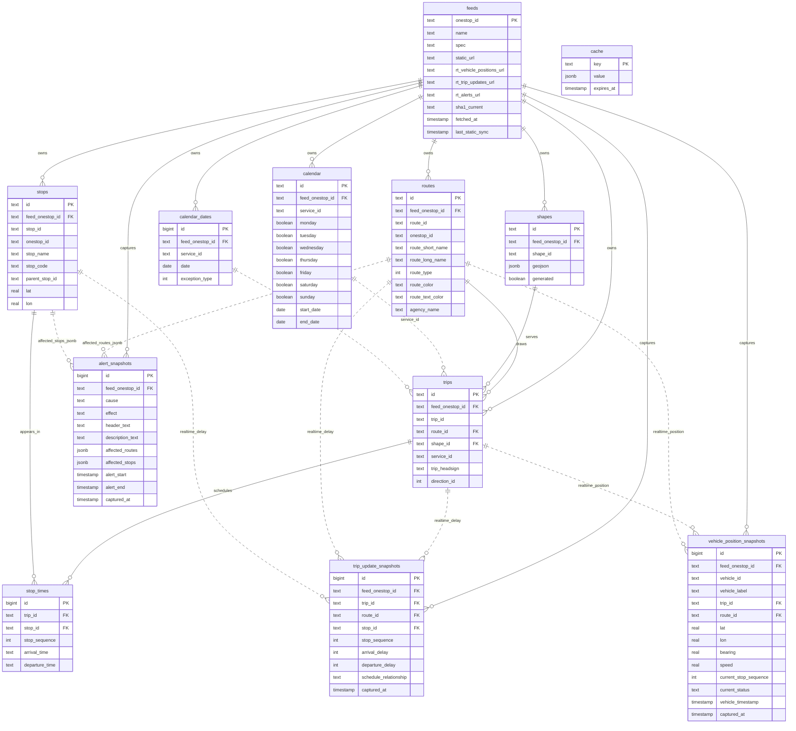
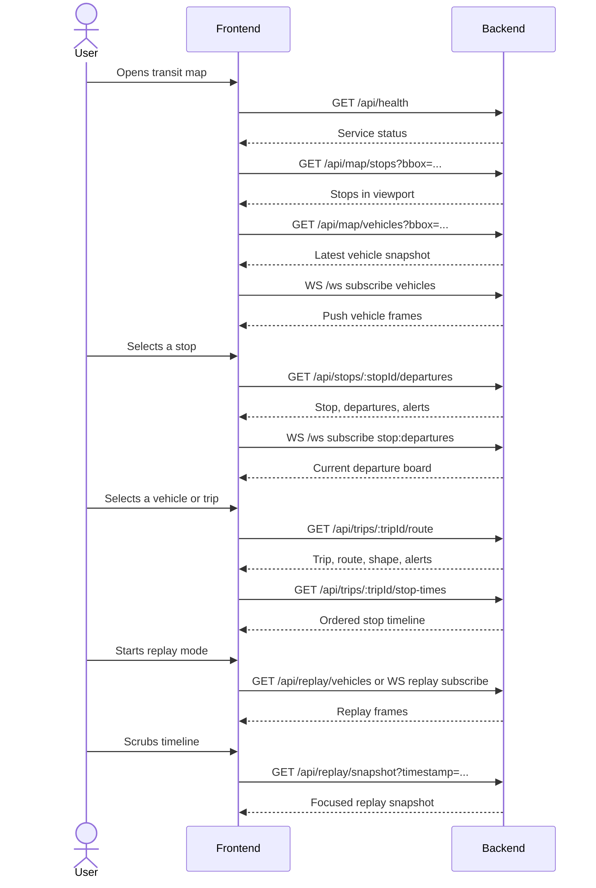

# Transit API Contract

This document is the frontend integration guide for the transit map backend. It only covers:

1. Database schema relations.
2. API and WebSocket usage, plus the expected user story sequence for integrating a custom frontend.

## Database Schema Relations

IDs exposed to the frontend are backend-stable IDs. For GTFS entities they are generally formatted as `<feed_onestop_id>:<gtfs_id>`, for example `f-9q9-bart:12TH`.



## Next Step Guide

Use REST for initial page load and detail panels. Use WebSocket for live map updates, WebSocket-based departure board refreshes, and replay playback.



### Common Request Formats

- `bbox` query strings use `min_lon,min_lat,max_lon,max_lat`, for example `-122.5,37.6,-121.8,37.9`.
- WebSocket `bbox` payloads use a number array: `[-122.5, 37.6, -121.8, 37.9]`.
- Date values use `YYYY-MM-DD`.
- Time values use GTFS time format: `HH:mm:ss`. Hours may exceed `23` for after-midnight service.
- Timestamp values use ISO date-time strings.
- Admin endpoints require `Authorization: Bearer <MAP_ADMIN_TOKEN>` only when `MAP_ADMIN_TOKEN` is configured.

## REST API Usage

### `GET /api/health`

Use this before rendering integration-dependent UI or for deployment checks.

Response shape:

```json
{
  "ok": true,
  "service": "@notion-kit/map-server"
}
```

### `GET /api/map/stops`

Use this when the map viewport changes and the frontend needs stop markers.

Query parameters:

| Parameter | Required | Description |
|---|---:|---|
| `bbox` | conditional | Viewport bounds. Required unless `lat`, `lon`, and `radius` are provided. |
| `lat`, `lon`, `radius` | conditional | Radius search alternative to `bbox`. `radius` is meters, max `10000`. |
| `route_type` | no | Accepted by the schema, but not currently applied to stop lookup. |
| `include_alerts` | no | Default `false`. Adds stop-level alerts. |
| `limit` | no | Default `200`, max `500`. |

Response includes `stops[]` with `id`, `stop_name`, `stop_code`, `lat`, `lon`, `location_type`, `wheelchair_boarding`, `feed_onestop_id`, and `alerts[]`.

Example:

```http
GET /api/map/stops?bbox=-122.5,37.6,-121.8,37.9&include_alerts=true&limit=50
```

### `GET /api/map/vehicles`

Use this as the HTTP snapshot fallback for vehicle markers before or alongside the WebSocket `vehicles` channel.

Query parameters:

| Parameter | Required | Description |
|---|---:|---|
| `bbox` | no | Viewport bounds. |
| `feed_onestop_id` | no | Restrict vehicles to one feed. |
| `route_type` | no | Restrict vehicles by GTFS route type. |

Response includes `vehicles[]` with vehicle identity, trip/route IDs, route display fields, coordinates, bearing/speed, current stop status, occupancy, and `captured_at`. `meta.snapshot_age_seconds` tells the frontend how stale the newest row is.

Example:

```http
GET /api/map/vehicles?bbox=-122.5,37.6,-121.8,37.9&feed_onestop_id=f-9q9-bart
```

### `GET /api/stops/:stopId/departures`

Use this for a stop detail drawer, departure board, or selected-stop panel.

Path parameters:

| Parameter | Description |
|---|---|
| `stopId` | Internal stop ID, for example `f-9q9-bart:12TH`. URL-encode this value in the browser. |

Query parameters:

| Parameter | Required | Description |
|---|---:|---|
| `date` | no | Service date. Defaults to today. |
| `start_time` | no | Window start. Defaults to current GTFS time. |
| `end_time` | no | Window end. If omitted, the backend uses `start_time + next`. |
| `next` | no | Seconds after `start_time`; default behavior is a 1-hour window. |
| `include_realtime` | no | Default `true`. Merges latest trip update delays. |
| `include_alerts` | no | Default `true`. Adds affected alerts. |
| `limit` | no | Default `30`, max `200`. |

Response includes `stop`, `departures[]`, `alerts[]`, and `meta.realtime_available`.

Example:

```http
GET /api/stops/f-9q9-bart%3A12TH/departures?date=2026-05-16&start_time=10:00:00&next=3600&include_realtime=true
```

### `GET /api/trips/:tripId/route`

Use this after a user selects a vehicle, trip, or departure and the frontend needs the route line plus route metadata.

Path parameters:

| Parameter | Description |
|---|---|
| `tripId` | Internal trip ID, for example `f-9q9-bart:trip-555`. URL-encode this value in the browser. |

Query parameters:

| Parameter | Required | Description |
|---|---:|---|
| `include_shape` | no | Default `true`. Includes route shape GeoJSON when available. |

Response includes `trip`, `route`, nullable `shape`, and route-level `alerts[]`.

Example:

```http
GET /api/trips/f-9q9-bart%3Atrip-555/route?include_shape=true
```

### `GET /api/trips/:tripId/stop-times`

Use this for the trip timeline: all scheduled stops, optional coordinates, and realtime delay overlays.

Path parameters:

| Parameter | Description |
|---|---|
| `tripId` | Internal trip ID. URL-encode this value in the browser. |

Query parameters:

| Parameter | Required | Description |
|---|---:|---|
| `date` | no | Service date. Defaults to today. |
| `include_realtime` | no | Default `true`. Adds latest realtime delays by stop. |
| `include_geometry` | no | Default `false`. Adds `lat` and `lon` for each stop. |

Response includes `trip_id`, `route_short_name`, `service_date`, and ordered `stop_times[]`. Each stop time includes scheduled/estimated departure, realtime delay fields, and `is_timepoint`.

Example:

```http
GET /api/trips/f-9q9-bart%3Atrip-555/stop-times?date=2026-05-16&include_realtime=true&include_geometry=true
```

### `GET /api/replay/vehicles`

Use this when the frontend wants to preload a short replay window and animate it locally.

Query parameters:

| Parameter | Required | Description |
|---|---:|---|
| `start` | yes | Replay start timestamp. |
| `end` | yes | Replay end timestamp. Must be after `start`; range cannot exceed 2 hours. |
| `step` | no | Frame bucket size in seconds. Default `30`. |
| `bbox` | no | Restrict replay to a viewport. |
| `feed_onestop_id` | no | Restrict replay to one feed. |

Response includes `frames[]`, where each frame has `timestamp` and `vehicles[]`. Use `meta.frame_count` and `meta.vehicle_count_peak` for playback setup.

Example:

```http
GET /api/replay/vehicles?start=2026-05-15T08:00:00Z&end=2026-05-15T08:30:00Z&step=30&bbox=-122.5,37.6,-121.8,37.9&feed_onestop_id=f-9q9-bart
```

### `GET /api/replay/snapshot`

Use this when the user scrubs to a point in time or opens a replay detail panel.

Query parameters:

| Parameter | Required | Description |
|---|---:|---|
| `timestamp` | yes | Replay timestamp to inspect. |
| `bbox` | no | Restrict snapshot to a viewport. |
| `feed_onestop_id` | no | Restrict snapshot to one feed. |
| `trip_id` | no | Focus on a trip. |
| `route_id` | no | Focus on a route. |
| `vehicle_id` | no | Focus on a vehicle. |
| `include_stop_times` | no | Default `false`. Adds the focused trip timeline. |
| `include_route` | no | Default `false`. Adds route shape for the focused trip. |
| `tolerance_seconds` | no | Default `60`, max `3600`. Snapshot search tolerance around `timestamp`. |

Response includes the requested `timestamp`, `closest_snapshot_at`, `snapshot_age_seconds`, `vehicles[]`, `alerts[]`, and optional `trip_stop_times` and `route`.

Example:

```http
GET /api/replay/snapshot?timestamp=2026-05-15T08:15:00Z&vehicle_id=1234&include_stop_times=true&include_route=true&tolerance_seconds=120
```

### `POST /api/admin/sync/static`

Use this from backend tooling, a cron job, or an admin console to discover Transitland feeds and import static GTFS tables.

Body parameters:

| Parameter | Required | Description |
|---|---:|---|
| `bbox` | conditional | Discover feeds within a bounding box. Required unless `feedIds` is provided. |
| `feedIds` or `feed_ids` | conditional | Explicit Transitland feed IDs. Required unless `bbox` is provided. |
| `force` | no | Default `false`. Re-import even when feed SHA has not changed. |

Response includes `synced[]`, `transitlandApiCallsUsed`, and `errors[]`.

Example:

```http
POST /api/admin/sync/static
Authorization: Bearer <MAP_ADMIN_TOKEN>
Content-Type: application/json

{
  "feedIds": ["f-9q9-bart"],
  "force": false
}
```

### `POST /api/admin/sync/realtime`

Use this from a scheduler every polling interval after static sync has stored direct agency GTFS-RT URLs on `feeds`.

Body parameters:

| Parameter | Required | Description |
|---|---:|---|
| `feedIds` or `feed_ids` | no | Restrict polling to selected feeds. If omitted, poll eligible feeds. |

Response includes `polled[]` and `errors[]`. After a successful poll, the backend broadcasts fresh data to WebSocket clients subscribed to `vehicles`.

Example:

```http
POST /api/admin/sync/realtime
Authorization: Bearer <MAP_ADMIN_TOKEN>
Content-Type: application/json

{
  "feedIds": ["f-9q9-bart"]
}
```

### `POST /api/admin/retention`

Use this from a daily maintenance job to remove expired realtime snapshots and cache rows. Current retention keeps vehicle positions and trip updates for 3 days, alerts for 7 days, and deletes expired cache rows.

Response shape:

```json
{
  "ok": true
}
```

## WebSocket Usage

Connect to:

```text
ws://<host>/ws
```

All client messages use this envelope:

```json
{
  "type": "subscribe",
  "channel": "vehicles",
  "id": "client-message-id",
  "payload": {}
}
```

Common message types:

| Type | Usage |
|---|---|
| `ping` | Backend replies with `pong` and the same `id`. |
| `subscribe` | Start a channel subscription. |
| `update` | Replace an existing channel subscription payload. |
| `unsubscribe` | Stop a channel subscription. Include `channel`. |

### Channel `vehicles`

Use this for live vehicle marker updates after the initial `GET /api/map/vehicles` snapshot.

Subscribe payload:

```json
{
  "bbox": [-122.5, 37.6, -121.8, 37.9],
  "feed_onestop_ids": ["f-9q9-bart"],
  "route_type": 1
}
```

Backend acknowledgement:

```json
{
  "type": "subscribed",
  "channel": "vehicles",
  "id": "client-message-id",
  "payload": {
    "interval_seconds": 15,
    "snapshot_age_seconds": 0
  }
}
```

Data messages:

```json
{
  "type": "data",
  "channel": "vehicles",
  "payload": {
    "timestamp": "2026-05-16T10:32:05.000Z",
    "vehicles": [],
    "alerts": []
  }
}
```

### Channel `stop:departures`

Use this while a stop detail panel is open to fetch the current departure board over the same WebSocket connection. The current implementation sends data immediately after `subscribe` or `update`; send `update` again when the frontend wants to refresh the window.

Subscribe payload:

```json
{
  "stop_id": "f-9q9-bart:12TH",
  "window_minutes": 60
}
```

Data messages include `stop_id`, `stop_name`, `timestamp`, `departures[]`, and `alerts[]`.

### Channel `replay`

Use this when the frontend wants backend-driven replay playback instead of preloading with `GET /api/replay/vehicles`.

Subscribe payload:

```json
{
  "start": "2026-05-15T08:00:00Z",
  "end": "2026-05-15T08:30:00Z",
  "speed": 10,
  "bbox": [-122.5, 37.6, -121.8, 37.9],
  "feed_onestop_ids": ["f-9q9-bart"]
}
```

Backend acknowledgement includes `start`, `end`, `speed`, `frame_interval_seconds`, `total_frames`, and `data_available`.

Replay data messages:

```json
{
  "type": "data",
  "channel": "replay",
  "payload": {
    "sim_timestamp": "2026-05-15T08:00:00.000Z",
    "frame_index": 0,
    "total_frames": 60,
    "vehicles": []
  }
}
```

Replay controls:

| Type | Payload | Usage |
|---|---|---|
| `pause` | none | Pause playback. |
| `resume` | none | Resume playback. |
| `set_speed` | `{ "speed": 30 }` | Change playback speed. |
| `seek` | `{ "timestamp": "2026-05-15T08:15:00Z" }` | Jump to the first replay frame at or after the timestamp. |
