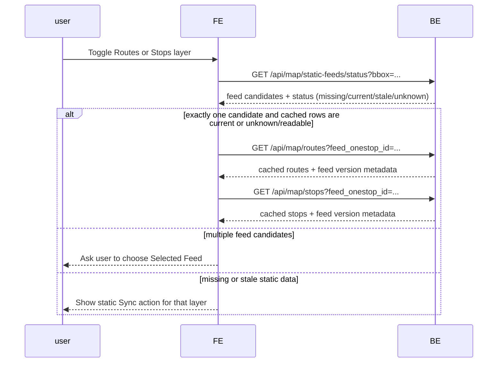
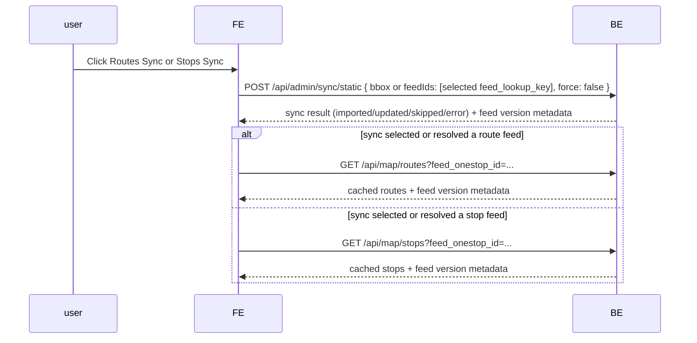
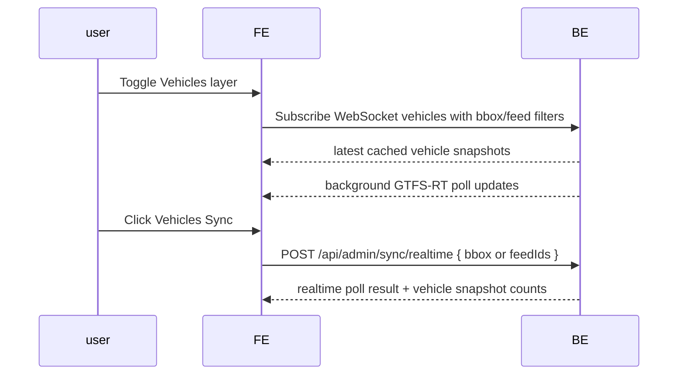

# Map server use cases

## ISSUE

1. **[已修正]** calling `/api/admin/sync/static` with payload
   ```json
   {"feedIds": ["f-u2m-bkk"], "force": false}

   // 200 OK
   {
      "synced": [
         {
               "feedOnestopId": "f-u2m-bkk",
               "sha1": "5e75f1764f599308b5640ee9b7d323c7475c5949",
               "status": "error",
               "stopsCount": 0,
               "routesCount": 0,
               "tripsCount": 0,
               "stopTimesCount": 0,
               "durationMs": 36600
         }
      ],
      "transitlandApiCallsUsed": 1,
      "errors": [
         {}
      ]
   }
   ```
   - Root cause: GTFS CSV rows were parsed once into typed rows where optional blank fields become `null` and numeric fields become numbers, then the static import row builders validated those typed rows a second time with schemas that only accepted raw CSV strings. BKK therefore failed before rows were built, even though the feed contains valid static data.
   - Fix: GTFS static schemas now accept both raw CSV values and already-parsed values for optional, numeric, and service-day fields.
   - Verified against `apps/map-server/docs/f-u2m-bkk-latest/`:
     - stops: 6,192
     - routes: 381
     - trips: 246,775
     - stop_times: 5,011,699
     - calendar_dates: 12,065
     - shapes: 1,572 generated shape rows from 671,020 shape points
   - Verified with `curl` against local `/api/admin/sync/static` using `{"feedIds":["f-u2m-bkk"],"force":false}`. The Transitland download now returns bytes correctly, and the browser error payload includes a real message instead of `{}`.
   - Local development caveat: BKK has 5,011,699 `stop_times` rows and exceeded the current 512 MB database project limit during end-to-end curl verification. In development, oversized feeds now import core static rows and return `status: "partial"` with `stopTimesCount: 0` instead of rolling back stops/routes/trips to zero. A production database with sufficient storage should run without this development-only stop-times cap.
   - Note: the full BKK fixture is large enough that an in-memory verification needs a larger local Node heap. The production import path should still be revisited for streaming/batched parsing before treating very large GTFS feeds as routine.

## Use cases

The following are use cases for the `@notion-kit/globe` app:

- case 1: realtime vehicles, I expect frontend will subscribe to Websocket to get the updated vehicle locations (and other informations)
  - case 1A: use bbox -> show realtime vehicles
  - case 1B: use quick location -> show realtime vehicles
- case 2: routes and stops
  - case 2A: click on a realtime vehicles -> display routes with stops (depending on which layer is enabled)
  - case 2B: click on a realtime vehicles -> show vehicle info (incluing route ID) -> click "view route" button -> show route with stops and realtime vehicles (including this vehicle)
  - case 2C: click on a route -> show the route with stops
  - case 2D: display a list of all routes in the city (by Onestop ID) -> click on a route/search result -> display that route on the map; clicking the rendered route triggers `case 2C`
  - case 2E: display a list of all routes in the city (by Onestop ID) -> click on a route -> shows all trips at a side panel
- case 3: departures
  - case 3A: click on a stop -> show departures at side panel
  - case 3B: display a list of all stops in the city (by Onestop ID) -> click on a stop/search result -> display that stop on the map; clicking the rendered stop triggers `case 3A`
- case 4: replay & snapshot (frontend not implemented yet, but should be considered in backend service)
  - case 4A: select time frame, bbox/location, vehicles(optional) -> show case 1~3
  - case 4B: select time, bbox/location, vehicle/stop/route -> show a static vehicle/stop/route, this will be useful for querying reports

## Current state

### Outline

1. Realtime vehicle sync is GTFS-RT only
   - 新增 TransitlandClient.discoverRealtimeVehicleFeeds({ bbox })
   - 用 `/operators?bbox=...` 找 operator，再找 GTFS_RT feeds
   - 用 `/feeds/{feedId}/download_latest_rt/vehicle_positions.json` 抓 vehicles
   - `/api/admin/sync/realtime` accepts bbox or feed IDs and must not fetch, version-check, or import static GTFS.
2. **[已修正]** `/api/map/vehicles` / WebSocket 的 auto-sync 行為已重構
   - 完全移除了 GET/WS 讀取時附帶的 auto-sync 副作用，提升讀取效能。
   - 改由 `WsHub` 內部實作專屬的 15 秒 background poller，定期收集活躍客戶端的 bbox/feed 範圍進行背景同步與廣播。
3. **[已修正]** Trip Route 與 Stop Times API 針對 404 進行 Graceful Fallback
   - 當 RT trip 不存在於 static DB 導致 404 時，API 現已能夠透過 `fallback_route_id` 或自動反查最近的 vehicle snapshot 取得 `route_id` 來回傳 fallback 結構，避免 UI 崩潰與報錯。
4. Static sync has explicit version/row-count semantics
   - 加了 static feed row count 檢查，避免「SHA 一樣但 tables 是空的」時直接 skip
   - `imported` means first successful import, `updated` means an existing feed was replaced, `skipped` means local SHA and required row counts are already usable, and `error` means that feed failed.
   - `/api/admin/sync/static` imports or refreshes static GTFS only; it must not poll GTFS-RT vehicle feeds.
5. Static GTFS status and list-read backend is implemented
   - `GET /api/map/static-feeds/status?bbox=...` performs read-only static feed discovery/status. It returns feed candidates with `missing`, `current`, `stale`, or `unknown`.
   - `GET /api/map/routes?feed_onestop_id=...` reads cached static routes by Feed Onestop ID.
   - `GET /api/map/stops?feed_onestop_id=...` reads cached static stops by Feed Onestop ID while preserving the previous bbox/radius stop query behavior.
   - Route/stop list APIs do not import static GTFS as a side effect.
6. OpenAPI/admin schema is updated
   - bbox body 從只接受 array 改成接受 string 或 bbox array
   - 這是為了修 `/api/admin/sync/static` 收到 string bbox 時 500 的問題
   - OpenAPI now documents static feed status, cached route list, feed-scoped stop list, and static sync result values.

Important decisions:

- Static GTFS and realtime GTFS-RT are separate flows. Vehicle toggles and vehicle Sync never trigger static GTFS status, fetch, or import.
- Routes and Stops may check static feed status and read cached rows when toggled, but importing/updating static GTFS requires an explicit layer Sync action.
- Routes and Stops each get their own Sync button because their active data source adapter may differ.
- Bbox belongs to discovery/status. Route/stop list reads should use `feed_onestop_id`.
- When a bbox resolves to multiple static feeds, backend returns candidates and the frontend chooses unless there is exactly one strong match.
- `/api/admin/sync/static` is acceptable for the current dev flow. A production user-facing flow should add a non-admin map sync endpoint so browser code does not need an admin token.

### Compare to use cases

| Use case                                                         | As-is before changes                                                                                | Current working tree                                                                                           | To-do / To-fix                                                                                                                                                                                                                                          |
| ---------------------------------------------------------------- | --------------------------------------------------------------------------------------------------- | -------------------------------------------------------------------------------------------------------------- | ------------------------------------------------------------------------------------------------------------------------------------------------------------------------------------------------------------------------------------------------------- |
| Case 1A: bbox -> realtime vehicles                               | `/api/map/vehicles` 只讀現有 snapshots；如果 DB 沒 snapshot 就空                                    | bbox 可用來 discover Transitland GTFS_RT feeds，sync 後 snapshot 可能進 DB；WS/vehicles API 也會嘗試 auto-sync | **[已修正]** 已從 GET/WS 移除 auto-sync 邏輯，改為由 WsHub 內的 15 秒 background poller 定期更新。                                                                                                                                                      |
| Case 1B: quick location -> realtime vehicles                     | quick location 只是改 bbox；backend 不會自動知道要 poll 哪些 feed                                   | 只要 quick location 產生 bbox，理論上可 discover 該區 realtime feeds                                           | **[已修正]** 只要 WS client 更新 subscription 的 bbox，poller 就會在背景定期為該 bbox 獲取最新資料並推送。                                                                                                                                              |
| Case 2A: click realtime vehicle -> route/stops                   | route/stops API 依賴 static GTFS trips/routes/stops；RT vehicle 如果只有 RT feed id，常常 join 不上 | 已嘗試把 RT feed 對應回 static GTFS feed，並修 trip id decoding                                                | **[已修正]** 已實作 graceful fallback。當查無 trip_id 時，會透過新增的 `fallback_route_id` 或自動查車輛最新 `route_id` 來回傳相對應的 route 線條與 alerts。已修復因 fallback 時漏傳資料導致 route 和 stops 沒有顯示的問題，確保地圖能正常繪製預備路線。 |
| Case 2B: realtime vehicle "view route"                           | 尚未實作 frontend "view route" 按鈕與對應狀態管理                                                   | 已實作 `RouteDetailsSheet` 與 store 狀態。可於 popup 中點擊按鈕跳轉至該路線                                    | **[已修正]** popup 加入 "View Route" 按鈕，點擊後會過濾車輛，並在右側面板列出經過站點。                                                                                                                                                                 |
| Case 2C: click on route line -> show stops                       | `<MapRoute>` 並非 interactive，點擊無反應                                                           | `RoutesLayer` 已加入 `interactive=true`，點擊路線即可跳出站點清單與詳細資訊                                    | **[已修正]** 點擊地圖上的路線將會連動至 store，觸發 `RouteDetailsSheet` 顯示。                                                                                                                                                                          |
| Case 2D: list routes by Feed Onestop ID                          | 沒有 feed-scoped route list API                                                                     | Backend has `GET /api/map/static-feeds/status?bbox=...` and `GET /api/map/routes?feed_onestop_id=...`          | Frontend route search/recent selection should render the route on the map only. The route details side panel opens after the user clicks the rendered route.                                                                                            |
| Case 3A: click stop -> departures                                | departures 依賴 static stop 資料與目前 realtime updates                                             | map-server 沒有真正針對 departures 做完整改造，只是間接受 static sync/feed scoping 影響                        | **[已修正]** 已驗證 departures API 在缺乏 static trips 時的穩定性。過濾邏輯能安全地略過無對應 static GTFS 的 RT 班次，不會拋出 500 錯誤。                                                                                                               |
| Case 3B: list stops by Feed Onestop ID                           | stops API was primarily bbox/radius scoped                                                          | Backend supports `GET /api/map/stops?feed_onestop_id=...` and returns static feed metadata                     | Frontend stop search/recent selection should render the stop on the map only. The departures side panel opens after the user clicks the rendered stop.                                                                                                  |
| Case 4A: replay by timeframe + bbox/location + optional vehicles | backend 已有 snapshot 概念，但 frontend 未實作                                                      | 新的 realtime snapshot 寫入會影響 replay 可用資料                                                              | **[未來規劃]** 需要定義 replay query contract：time range、bbox、vehicle ids、route ids、stop ids 如何 filter，以及是否要 join static GTFS                                                                                                              |
| Case 4B: static vehicle/stop/route at selected time              | backend 有 snapshot rows，但靜態時間點查詢契約不完整                                                | 沒有完整補齊                                                                                                   | **[未來規劃]** 需要先設計 snapshot API：selected time 查最近一筆？exact timestamp？route/stops 是 current static 還是 historical static？                                                                                                               |

## Next step

### Frontend static GTFS behavior for case 2D and 3B

The backend portion of static GTFS status/sync/list behavior is in place. The next milestone is wiring the frontend to use the new backend contract without re-coupling static GTFS to realtime vehicles.

1. Split the vehicle Sync action from static GTFS
   - Update the vehicle panel so its Sync button calls only `/api/admin/sync/realtime`.
   - Remove or stop using any combined helper that calls static sync and realtime sync together.
   - Vehicle layer toggles should only subscribe/read realtime vehicle data.
   - Rename the action from "Sync region" to a vehicle-specific label such as "Sync vehicles".
   - Sync completion messaging should report realtime feed and vehicle counts only; it should not mention static feeds.

2. Add Routes panel static status/list behavior
   - Add a `RoutesPanel` with visual treatment similar to `VehiclesPanel`.
   - When Routes is enabled, call `GET /api/map/static-feeds/status?bbox=...`.
   - If exactly one feed candidate is returned, auto-select it as the Selected Feed.
   - If multiple candidate feeds are returned, show candidate selection and do not guess.
   - Treat `current` as fully usable.
   - Treat `unknown` with readable cached rows as usable with a warning.
   - Treat `missing` and `stale` as needing a Routes Sync action before list loading by default.
   - Once a usable Selected Feed exists, call `GET /api/map/routes?feed_onestop_id=...`.
   - Route list discovery should use bbox, but route list reads should not be bbox-scoped.

3. Add Stops panel static status/list behavior
   - Add a `StopsPanel` with visual treatment similar to `VehiclesPanel`.
   - When Stops is enabled, call `GET /api/map/static-feeds/status?bbox=...`.
   - If exactly one feed candidate is returned, auto-select it as the Selected Feed.
   - If multiple candidate feeds are returned, show candidate selection and do not guess.
   - Treat `current` as fully usable.
   - Treat `unknown` with readable cached rows as usable with a warning.
   - Treat `missing` and `stale` as needing a Stops Sync action before list loading by default.
   - Once a usable Selected Feed exists, call `GET /api/map/stops?feed_onestop_id=...`.
   - Stop list discovery should use bbox, but stop list reads should not be bbox-scoped.

4. Add route/stop search and recent quick actions
   - Use a popover + command pattern, following `packages/ui/src/timezone-menu/`, for route and stop search.
   - Keep the panel itself compact and show the latest 5 routes or stops the user searched or opened.
   - Recent routes and stops should act as quick actions that render the route or stop on the map.
   - The command list should support searching across route display names/IDs and stop names/codes/IDs.
   - Clicking a route from search or recents should set map route state by route ID only and should not open the route details side panel.
   - Clicking the rendered route on the map should set route detail state and trigger case 2C.
   - Clicking a stop from search or recents should set map stop state and should not open the departures side panel.
   - Clicking the rendered stop on the map should set selected stop state and trigger case 3A.
   - Preserve separate states for feed-wide stop browsing and route-detail stops so selecting a city stop does not overwrite route-detail stop rendering.

5. Add separate Routes and Stops Sync buttons
   - Add one Sync button for Routes and one Sync button for Stops.
   - Each Sync button should use the layer's current data source adapter and current bbox.
   - Store both `feed_lookup_key` and `feed_onestop_id` for the Selected Feed.
   - On click, call `/api/admin/sync/static` with the current bbox or selected Feed Lookup Key.
   - After sync completes, load the route or stop list by Feed Onestop ID.
   - If the user already selected a feed, reload that feed after sync.
   - If sync was bbox-based and returns multiple feeds, show candidate selection before loading lists.

6. Add production-facing static sync endpoint
   - `/api/admin/sync/static` is acceptable during dev.
   - Before shipping this as normal browser behavior, add a non-admin map endpoint for static sync/poll so frontend code does not require `VITE_MAP_ADMIN_TOKEN`.
   - Keep the same explicit-sync semantics: no import on layer toggle and no GTFS-RT polling in static sync.

7. Verify with real feeds
   - Start with a bbox that resolves to a single obvious feed.
   - Confirm static status, initial import, latest-version skip, route list rendering, stop list rendering, route click, and stop departures.
   - Then test a bbox that returns multiple candidate feeds and confirm frontend candidate selection.
   - Confirm vehicle Sync does not call static status or static sync APIs.

### Deferred backend work

- Add row-level diff/version storage only if historical static snapshots become necessary for replay.
- Define replay static-version semantics when replay implementation starts. For now, replay should remain out of scope.

### Static GTFS status/sync API sequences

Layer toggle should be read-only. It may discover static feed status and read cached lists, but it must not fetch or import GTFS static rows.



Routes and Stops each expose their own static Sync action. Static Sync imports or refreshes GTFS static rows, then the frontend reads the relevant list API by Feed Onestop ID.



Realtime vehicle sync remains a separate GTFS-RT flow. Vehicle layer toggles or vehicle Sync actions must not call static status or static sync APIs.


