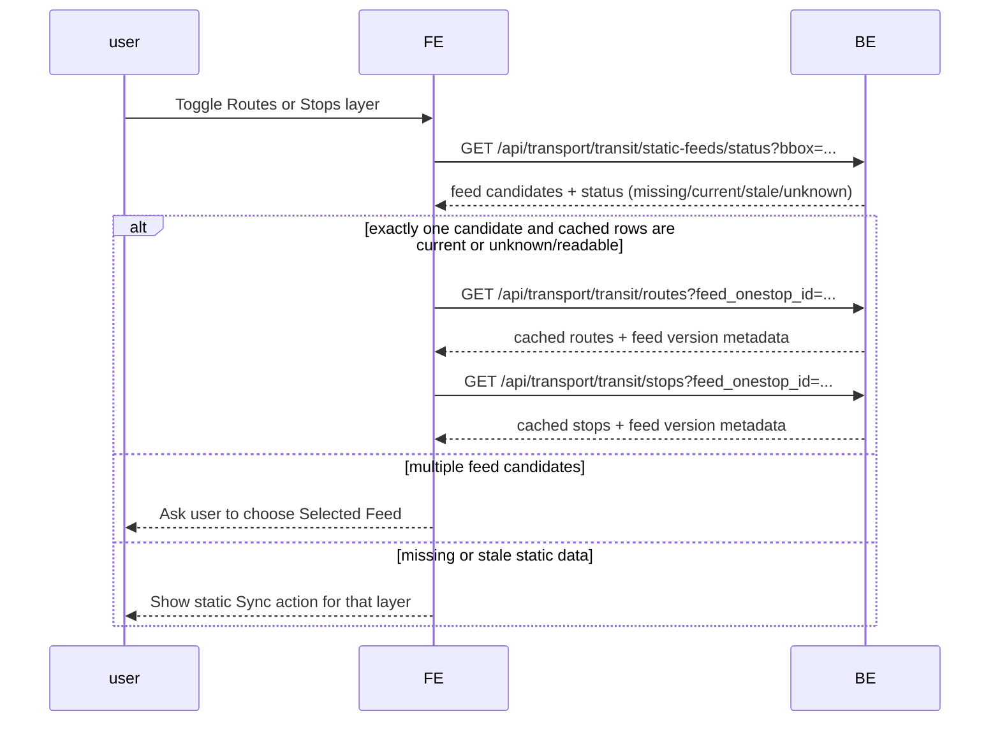
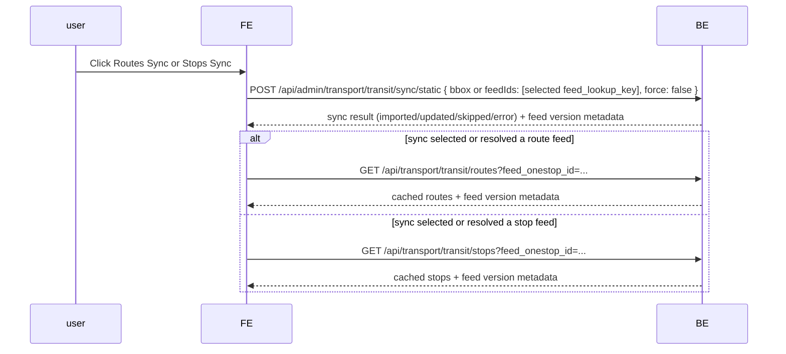
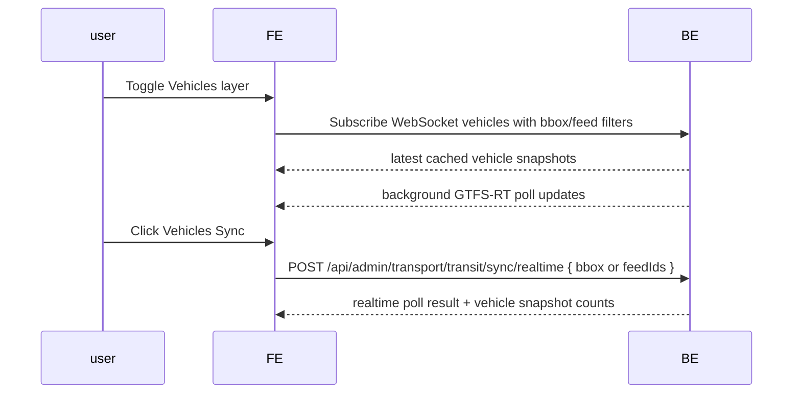

# Map server use cases

## ISSUE

## Use cases

The following are use cases for the `@notion-kit/globe` app:

- case 1: realtime vehicles, I expect frontend will subscribe to Websocket to get the updated vehicle locations (and other informations)
  - case 1A: use bbox -> show realtime vehicles
  - case 1B: use quick location -> show realtime vehicles
- case 2: routes and stops
  - case 2A: click on a realtime vehicles -> display routes with stops (depending on which layer is enabled)
  - case 2B: click on a realtime vehicles -> show vehicle info (incluing route ID) -> click "view route" button -> show route with stops and realtime vehicles (including this vehicle)
  - case 2C: click on a rendered route -> open route details for that route and list trips in a selected time range
    - route details should show:
      - selected route metadata
      - service date and time-range controls
      - trips matching the route and time range
    - expanding a trip should:
      - show all stops with scheduled/realtime stop times
      - render that trip's stop dots on the map route
      - allow clicking a stop dot to fly the map to that stop
  - case 2D: display a list of all routes in the city (by Onestop ID) -> click on a route/search result -> display that route on the map; clicking the rendered route triggers `case 2C`
- case 3: departures
  - case 3A: click on a stop -> show departures at side panel
  - case 3B: display a list of all stops in the city (by Onestop ID) -> click on a stop/search result -> display that stop on the map; clicking the rendered stop triggers `case 3A`
- case 4: replay & snapshot (frontend not implemented yet, but should be considered in backend service)
  - case 4A: select time frame, bbox/location, vehicles(optional) -> show case 1~3
  - case 4B: select time, bbox/location, vehicle/stop/route -> show a static vehicle/stop/route, this will be useful for querying reports

## Current state

### Outline

1. Realtime vehicle sync is GTFS-RT only
   - `TransitlandClient.discoverRealtimeVehicleFeeds({ bbox })` discovers GTFS-RT vehicle feeds from Transitland.
   - `/api/admin/transport/transit/sync/realtime` accepts bbox or feed IDs and polls realtime vehicle feeds only.
   - `/api/transport/:provider/vehicles` and WebSocket reads no longer perform inline sync work.
   - `WsHub` owns the 15 second background poller for active client bbox/feed subscriptions.

2. Static GTFS sync is explicit and separate from realtime
   - `/api/admin/transport/:provider/sync/static` imports or refreshes static GTFS only; it must not poll GTFS-RT vehicle feeds.
   - Static sync has explicit result semantics: `imported`, `updated`, `skipped`, `partial`, and `error`.
   - Static feed row counts prevent skipping a feed when SHA is unchanged but local tables are empty.
   - Large local feeds may import as `partial` when `stop_times` exceeds the development storage/import cap.

3. Static GTFS status/list APIs are implemented
   - `GET /api/transport/:provider/static-feeds/status?bbox=...` performs read-only static feed discovery/status and returns `missing`, `current`, `stale`, or `unknown` candidates.
   - `GET /api/transport/:provider/routes?feed_onestop_id=...` reads cached static routes by Feed Onestop ID.
   - `GET /api/transport/:provider/stops?feed_onestop_id=...` reads cached static stops by Feed Onestop ID while preserving previous bbox/radius stop query behavior.
   - Route/stop list APIs do not import static GTFS as a side effect.

4. Route details now follow the updated case `2C`
   - Route search/recent selection renders a route on the map without opening route details.
   - `GET /api/transport/:provider/route-shape?route_id=...` returns representative route geometry without pretending the route ID is a trip ID.
   - Clicking the rendered route opens `RouteDetailsSheet`.
   - `GET /api/transport/:provider/trips?route_id=...&service_date=...&start_time=...&end_time=...` lists route trips for the selected time range.
   - If local `stop_times` were skipped for a large feed, `/api/transport/:provider/trips` falls back to listing trips by `route_id` with null first/last departure summaries.
   - Expanding a concrete trip calls `/api/transport/:provider/trips/:tripId/stop-times` and renders stop dots for that expanded trip.

5. Scoped GTFS ID decoding is centralized
   - `decodeRepeatedly`/`scopedIdSchema` handle plain, once-encoded, and twice-encoded internal IDs.
   - Trip path params, `fallback_route_id`, replay `trip_id`/`route_id`, route shape/trip queries, and stop departure path params use the shared decoder.
   - Frontend still uses `encodeURIComponent` for path segments; backend decoding is the source of truth at API boundaries.

6. Frontend static feed panels are wired
   - Vehicle sync is separated from static sync.
   - Routes and Stops panels discover static feed status by bbox, select a feed, sync static rows explicitly, and read lists by Feed Onestop ID.
   - Route and stop search use the compact popover/command pattern with recent quick actions.
   - Route search renders route-only state; stop search renders stop-only state; side panels open only after clicking rendered map entities.

7. OpenAPI/admin schema is updated
   - bbox body accepts string or bbox array where needed.
   - OpenAPI documents static feed status, cached route list, route shape, route trips, feed-scoped stop list, trip stop times, and static sync result values.

8. Map-server cleanup has started
   - Unused exports and the unused `db/rows.ts` module were removed.
   - Map-server lint, type-check, tests, and formatting are currently green.

Important decisions:

- Static GTFS and realtime GTFS-RT are separate flows. Vehicle toggles and vehicle Sync never trigger static GTFS status, fetch, or import.
- Routes and Stops may check static feed status and read cached rows when toggled, but importing/updating static GTFS requires an explicit layer Sync action.
- Routes and Stops each get their own Sync button because their active data source adapter may differ.
- Bbox belongs to discovery/status. Route/stop list reads should use `feed_onestop_id`.
- When a bbox resolves to multiple static feeds, backend returns candidates and the frontend chooses unless there is exactly one strong match.
- `/api/admin/transport/:provider/sync/static` is acceptable for the current dev flow. A production user-facing flow should add a non-admin map sync endpoint so browser code does not need an admin token.

## Next step

### Verify the route/stop experience with real feeds

1. Test a feed with full `stop_times`
   - Use a small or medium static feed where `stop_times` imports fully.
   - Confirm route search, route rendering, route click, route trips in a selected time range, trip expansion, stop-time rows, stop dots, stop-dot fly-to, and stop departures.
   - Confirm encoded scoped IDs work in path params and query params.

2. Test BKK partial import behavior
   - Confirm `GET /api/transport/:provider/trips?route_id=f-u2m-bkk:H5...` returns trip rows even when local `stop_times` are skipped.
   - Confirm the route details UI handles null first/last departure summaries gracefully.
   - Confirm trip expansion communicates that stop times are unavailable rather than silently appearing broken.

3. Test static feed discovery edge cases
   - Test a bbox that resolves to exactly one strong static feed candidate.
   - Test a bbox that resolves to multiple candidate feeds and confirm frontend candidate selection.
   - Confirm vehicle Sync does not call static status or static sync APIs.
   - Confirm route/stop layer toggles do not import static GTFS.

### Make static sync production-facing

1. Add a non-admin static sync endpoint
   - `/api/admin/sync/static` is acceptable during dev.
   - Before shipping normal browser behavior, add a non-admin map endpoint for static sync/poll so frontend code does not require `VITE_MAP_ADMIN_TOKEN`.
   - Preserve explicit-sync semantics: no import on layer toggle and no GTFS-RT polling in static sync.

2. Decide sync job semantics
   - Large static imports should not block the browser request indefinitely.
   - Consider returning a job/status resource for long-running static imports.
   - Keep feed selection based on `feed_lookup_key` plus `feed_onestop_id`.

### Fix large GTFS static import scalability

1. Replace development-only `stop_times` skipping with a scalable import path
   - Stream and batch parse large GTFS files instead of materializing the full dataset in memory.
   - Insert `stop_times` in storage-aware chunks.
   - Preserve all-or-core import semantics explicitly so partial imports are visible to the frontend.

2. Improve route-trip behavior when stop times are absent
   - Today `/api/transport/:provider/trips` can fall back to trips by route without time summaries.
   - Decide whether the UI should hide time-range filtering, show an explicit "schedule unavailable" state, or trigger a full import job.

### Continue map-server cleanup

1. Keep pruning dead code opportunistically
   - The unused `db/rows.ts` module and unused repository exports have been removed.
   - Continue using lint/type-check plus reference tracing before deleting public exports.

2. Reduce duplicated route-shape fallback code
   - `map/controller.ts` and `trips/controller.ts` both build representative/generated shapes from trip stop geometry.
   - Extract a small shared service only if the duplication grows or needs another caller.

### Deferred backend work

- Add row-level diff/version storage only if historical static snapshots become necessary for replay.
- Define replay static-version semantics when replay implementation starts. For now, replay should remain out of scope.

### Static GTFS status/sync API sequences

Layer toggle should be read-only. It may discover static feed status and read cached lists, but it must not fetch or import GTFS static rows.

Routes and Stops each expose their own static Sync action. Static Sync imports or refreshes GTFS static rows, then the frontend reads the relevant list API by Feed Onestop ID.

Realtime vehicle sync remains a separate GTFS-RT flow. Vehicle layer toggles or vehicle Sync actions must not call static status or static sync APIs.

