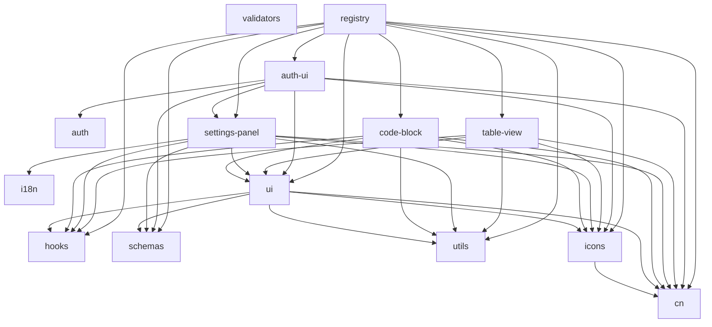

# Notion-Kit Package Dependencies Tree

This diagram shows the internal dependencies between packages in the notion-kit monorepo.

```mermaid
graph TD
    %% Base packages (no dependencies)
    auth[auth]
    cn[cn]
    hooks[hooks]
    i18n[i18n]
    schemas[schemas]
    utils[utils]
    validators[validators]
    
    %% Level 1 - depends on base packages
    icons --> cn
    
    %% Level 2 - depends on Level 1
    ui --> cn
    ui --> hooks
    ui --> icons
    ui --> schemas
    ui --> utils
    
    %% Level 3 - depends on Level 2
    code-block --> cn
    code-block --> hooks
    code-block --> icons
    code-block --> ui
    code-block --> utils

    settings-panel --> cn
    settings-panel --> hooks
    settings-panel --> i18n
    settings-panel --> icons
    settings-panel --> schemas
    settings-panel --> ui
    settings-panel --> utils
    
    table-view --> cn
    table-view --> hooks
    table-view --> icons
    table-view --> ui
    table-view --> utils
    
    %% Level 4 - depends on Level 3
    auth-ui --> auth
    auth-ui --> cn
    auth-ui --> icons
    auth-ui --> schemas
    auth-ui --> settings-panel
    auth-ui --> ui
    
    %% Level 5 - depends on Level 4
    registry --> auth-ui
    registry --> cn
    registry --> code-block
    registry --> hooks
    registry --> icons
    registry --> schemas
    registry --> settings-panel
    registry --> table-view
    registry --> ui
    registry --> utils
```

## Package Dependency Levels

### Level 0 (No internal dependencies)

- `auth` - Authentication logic
- `cn` - Utility for className merging
- `hooks` - React hooks
- `i18n` - Internationalization
- `schemas` - Zod schemas
- `utils` - Date/time utilities
- `validators` - Validation logic

### Level 1 (Depends only on Level 0)

- `icons` → cn

### Level 2 (Depends on Level 0-1)

- `ui` → cn, hooks, icons, schemas, utils

### Level 3 (Depends on Level 0-2)

- `code-block` → cn, hooks, icons, ui, utils
- `settings-panel` → cn, hooks, i18n, icons, schemas, ui, utils
- `table-view` → cn, hooks, icons, ui, utils

### Level 4 (Depends on Level 0-3)

- `auth-ui` → auth, cn, icons, schemas, settings-panel, ui

### Level 5 (Depends on Level 0-4)

- `registry` → auth-ui, cn, code-block, hooks, icons, schemas, settings-panel, table-view, ui, utils
