# Notion-Kit Package Dependencies Tree

This diagram shows the internal dependencies between packages in the notion-kit monorepo.

```mermaid
graph TD
    %% Base packages (no dependencies)
    cn[cn]
    utils[utils]
    hooks[hooks]
    schemas[schemas]
    i18n[i18n]
    auth[auth]
    
    %% Level 1 - depends on base packages
    icons --> cn
    spinner --> cn
    selectable --> cn
    shadcn --> cn
    
    %% Level 2 - depends on Level 1
    single-image-dropzone --> cn
    single-image-dropzone --> spinner
    
    icon-block --> cn
    icon-block --> shadcn
    icon-block --> spinner
    
    tags-input --> cn
    tags-input --> shadcn
    tags-input --> utils
    
    common --> cn
    common --> hooks
    common --> shadcn
    common --> spinner
    
    %% Level 3 - depends on Level 2
    tree --> cn
    
    icon-menu --> cn
    icon-menu --> common
    icon-menu --> icon-block
    icon-menu --> shadcn
    icon-menu --> spinner
    icon-menu --> utils
    
    settings-panel --> cn
    settings-panel --> common
    settings-panel --> hooks
    settings-panel --> i18n
    settings-panel --> icon-block
    settings-panel --> icon-menu
    settings-panel --> icons
    settings-panel --> schemas
    settings-panel --> shadcn
    settings-panel --> spinner
    settings-panel --> tags-input
    settings-panel --> utils
    
    navbar --> cn
    navbar --> hooks
    navbar --> icon-block
    navbar --> icon-menu
    navbar --> icons
    navbar --> schemas
    navbar --> shadcn
    navbar --> spinner
    navbar --> utils
    
    auth-ui --> cn
    auth-ui --> auth
    auth-ui --> icon-block
    auth-ui --> icon-menu
    auth-ui --> icons
    auth-ui --> schemas
    auth-ui --> settings-panel
    auth-ui --> shadcn
    auth-ui --> spinner
    
    %% Level 4 - depends on Level 3
    sidebar --> cn
    sidebar --> hooks
    sidebar --> icons
    sidebar --> shadcn
    sidebar --> spinner
    
    %% tree/presets subpackage (virtual node for documentation)
    tree-presets[tree/presets] --> cn
    tree-presets --> icons
    tree-presets --> shadcn
    
    %% sidebar/presets subpackage (virtual node for documentation)
    sidebar-presets[sidebar/presets] --> cn
    sidebar-presets --> hooks
    sidebar-presets --> icon-block
    sidebar-presets --> icon-menu
    sidebar-presets --> icons
    sidebar-presets --> schemas
    sidebar-presets --> shadcn
    sidebar-presets --> spinner
    sidebar-presets --> tree
    sidebar-presets --> utils
```

## Package Dependency Levels

### Level 0 (No internal dependencies)

- `cn` - Utility for className merging
- `utils` - Date/time utilities
- `hooks` - React hooks
- `schemas` - Zod schemas
- `i18n` - Internationalization
- `auth` - Authentication logic

### Level 1 (Depends only on Level 0)

- `icons` → cn
- `spinner` → cn
- `selectable` → cn
- `shadcn` → cn
- `tree` → cn

### Level 2 (Depends on Level 0-1)

- `icon-block` → cn, shadcn, spinner
- `single-image-dropzone` → cn, spinner
- `tags-input` → cn, shadcn, utils
- `common` → cn, hooks, shadcn, spinner
- `tree/presets` → cn, icons, shadcn
- `sidebar` → cn, hooks, icons, shadcn, spinner

### Level 3 (Depends on Level 0-2)

- `icon-menu` → cn, common, icon-block, shadcn, spinner, utils
- `settings-panel` → cn, common, hooks, i18n, icon-block, icon-menu, icons, schemas, shadcn, spinner, tags-input, utils
- `navbar` → cn, hooks, icon-block, icon-menu, icons, schemas, shadcn, spinner, utils
- `auth-ui` → cn, auth, icon-block, icon-menu, icons, schemas, settings-panel, shadcn, spinner

### Level 4 (Depends on Level 0-3)

- `sidebar/presets` → cn, hooks, icon-block, icon-menu, icons, schemas, shadcn, spinner, tree, utils
