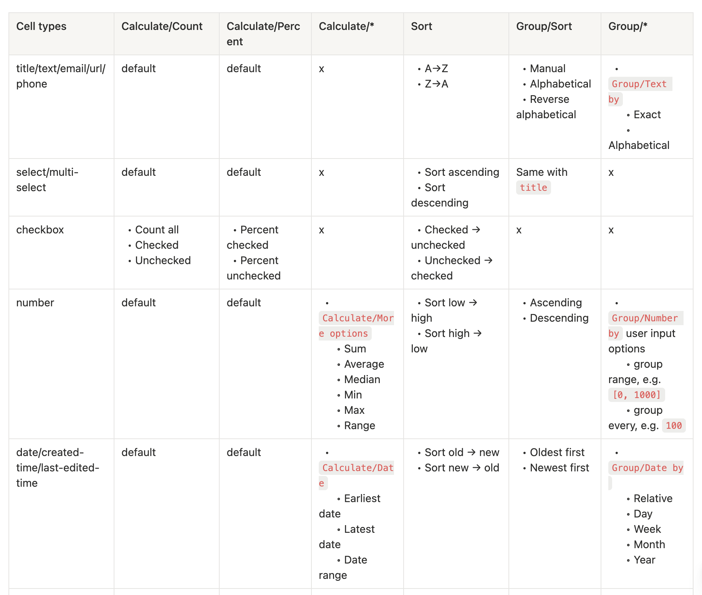
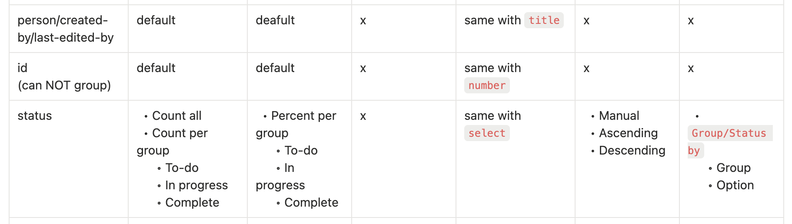

# Plugins

### Calculating, sorting and grouping

#### Used-in

- Calculating: the options in `calc-menu`
- Sorting: the sorting options in `sort-menu`, `prop-menu`
- Grouping: the options in `edit-group-menu`

#### Definitions

- Default `Calculate/Count`
  - Count all
  - Count values
  - Count unique values
  - Count empty
  - Count not empty
- Default `Calculate/Percent`
  - Percent empty
  - Percent not empty




## Implementation direction

### Goal

The built-in `@notion-kit/table-hook/plugins` factories completely support the function matrix above. Plugin capabilities are the source of truth: generic table-view menus discover registered functions from the current column plugin instead of maintaining property-type switches.

This branch includes the complete path for each matrix option:

1. register the function on the plugin;
2. expose it in the relevant menu;
3. persist the selected stable method ID;
4. resolve and execute the selected function;
5. fall back safely for old resources and legacy plugins.

### Architecture

`@notion-kit/table-hook/plugins` defines plugin contracts, built-in data semantics, and these capabilities:

- `sorting.methods` and `sorting.defaultMethod`
- `grouping.methods` and `grouping.defaultMethod`
- `counting`, grouped for menu presentation

It also provides resolver fallbacks:

- sorting falls back from the registered default/first method to legacy `compare`;
- grouping falls back from the registered default/first method to legacy `toGroupValue` or `toValue`;
- counting resolves a method ID from the plugin's registered groups.

`@notion-kit/table-view` owns the existing UI components and exposes no-argument wrappers that inject them into the headless factories. Its `DEFAULT_PLUGINS` is the configured default list:

```tsx
import type { CellPlugin } from "@notion-kit/table-hook/plugins";
import { title as createTitle } from "@notion-kit/table-hook/plugins";
import { title as createTableViewTitle } from "@notion-kit/table-view";

const customTitle = createTitle({
  icon: <CustomTitleIcon />,
  renderCell: (props) => <CustomTitleCell {...props} />,
});
const tableViewTitle = createTableViewTitle();

const customPlugin: CellPlugin<"custom", string, undefined> = {
  // Developers may still implement the structural contract directly.
  // ...
};
```

### Capability policy

- Stable method IDs, never function references or display labels, are persisted.
- A missing or unknown method ID falls back to the plugin default, then the first registered method, then the existing legacy field where applicable.
- Existing `compare`, `toValue`, and `toGroupValue` support remains during this migration.
- Unsupported options are omitted from menus rather than rendered as disabled placeholders.
- Shared mechanics, built-in data semantics, registrations, and renderer prop adaptation live in table-hook. Table-view plugin wrappers only inject components and icons.
- Generic menu components must not branch on built-in plugin IDs when a capability descriptor can provide the option.

Table-hook also owns cross-plugin method configuration. `useTableView` exposes `weekStartsOn`, using `0` for Sunday through `6` for Saturday and defaulting to `1` (Monday). This is runtime table configuration, not duplicated in each date column and not stored as a plugin method ID. Grouping method context must expose it to date plugins.

### Calculating

`calc-menu` renders the selected plugin's registered counting groups and functions. Existing count results remain strings.

- Title, text, email, URL, phone, select, multi-select, number, date, created time, and last edited time keep the existing default Count and Percent policy.
- Checkbox keeps Count all/checked/unchecked and Percent checked/unchecked.
- Number adds Sum, Average, Median, Min, Max, and Range.
- Date plugins add Earliest date, Latest date, and Date range.

Number calculation results reuse the column's `NumberConfig.format` and `NumberConfig.round`. Currency and percent units remain visible. Formatting should be extracted from the current number cell into a shared pure utility so cells, calculations, and numeric group labels cannot drift.

Date range calculation uses the earliest valid start and the latest valid end, falling back to that value's start when no end exists. Date-only values display a timezone-aware calendar-day duration. Values containing time display an elapsed day/hour/minute duration with at most two non-zero units. Empty input returns an empty result. The formatter is a shared pure utility; calculation functions do not return React nodes.

### Row sorting and group sorting

Each plugin registers its row sorting method and labels. Select and multi-select use the first selected option. Existing empty ordering is preserved: empty number, select, and date values sort last in ascending order.

`Group/Sort` reuses the grouped plugin's registered sorting methods instead of introducing another family of plugin functions. `edit-group-menu` offers:

- Manual, backed by the existing `groupOrder` drag-and-drop behavior;
- the plugin's sorting methods, applied to group values.

Because the current sorting function accepts rows, the implementation may extend the method descriptor with a value comparator or another reusable primitive. Row sorting and group sorting must still share one registered semantic definition rather than duplicate comparator logic.

### Grouping keys

Grouping method selection is persisted independently from group sorting.

- Text-like `Exact` groups by the complete value.
- Text-like `Alphabetical` groups by the case-insensitive first displayed character. Empty values keep the existing `(Empty)` group; digits and symbols use their own first character.
- Number initially supports fixed interval choices only: every 1, 10, 100, or 1000. Buckets are half-open `[start, end)`, so an exact boundary starts the next bucket. Negative values use floor-based buckets. Labels reuse number formatting.
- Date Day/Week/Month/Year and Relative grouping use `DateConfig.tz`. Week boundaries use table-hook's `weekStartsOn` configuration. Date ranges use their start date.
- Relative date buckets are non-overlapping: Today, Yesterday, Tomorrow, This week, Last week, Next week, Earlier, and Later. Single-day buckets take precedence over week buckets.
- Select and multi-select preserve their existing first-option grouping behavior.

### State and compatibility

The implementation should add the smallest backward-compatible resource/state fields needed for:

- row sorting method ID;
- grouping method ID;
- group sorting mode/method ID;
- calculation method ID (already represented by column counting state).

Old resources without these fields must resolve to the same effective defaults they use today. Controlled state and resource callbacks must round-trip new method IDs. Unknown IDs must not crash rendering or execution.

### Verification policy

- Test every built-in plugin's registered method IDs and groups.
- Test custom plugin discovery through calculation, sorting, and grouping menus without editing generic menu code.
- Test numeric calculations with empty, negative, decimal, and invalid values and verify configured units/rounding.
- Test numeric interval grouping for 1, 10, 100, and 1000, including exact and negative boundaries.
- Test date grouping around timezone midnight, configured Sunday and Monday week boundaries, month/year boundaries, and range start dates.
- Test date duration formatting for date-only, date-time, range-end fallback, and empty inputs.
- Test selected/default/first/legacy/unknown resolver fallbacks and old resource compatibility.
- Run focused tests, typecheck, lint, and builds for both `@notion-kit/table-hook` and `@notion-kit/table-view`.

Custom arbitrary numeric ranges, new plugin types, dependency additions, and removal of legacy plugin fields are outside this branch.
