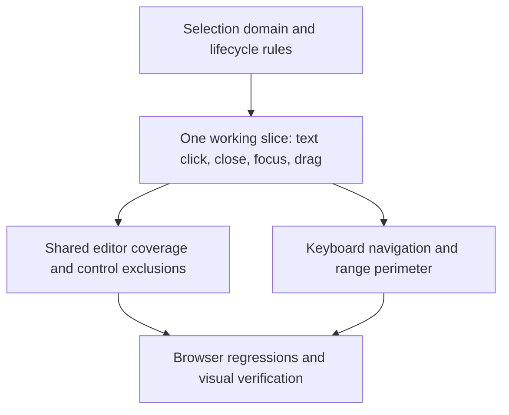

# Table Cell Selection Implementation Plan

Status: Approved by the user on September 8, 2026. The task breakdown in `tasks/todo.md` was approved. Implementation is complete on `feat/cell-selection`; functional verification is complete; the user deferred coverage compliance for this first version.

**Goal:** Implement the approved [cell-selection specification](cell-selection-spec.md) for table layout.

**Architecture:** Keep TanStack's registered cell-selection feature as the sole range-state and geometry owner. Add a table-scoped interaction coordinator and connect common cell frames and editor lifecycle boundaries to it. Keep transient gesture/editor state out of persisted table resources.

**Tech stack:** Existing React 19, TypeScript 6, TanStack Table 9.2.4, workspace UI primitives, Vitest/RTL, and Playwright. No dependency changes.

## Global Constraints

- Only `layout="table"`; title and checkbox are data cells, non-data controls are excluded.
- Preserve click-to-edit and checkbox toggling. Drag and modifier selection never mutate values.
- Editors own their keyboard events; selection UI is hidden while editing.
- Use `bg-blue/5` fill and the existing `shadow-cell-focus` perimeter without internal seams.
- No clipboard, fill, touch, auto-scroll, persisted selection API, CI, or database changes.
- Follow `.agents/guidelines/coding.md` and the component-primitives skill before code edits.
- Execution stays in this task unless the user requests delegation. This document defines phases and checkpoints; the gated task list is recorded separately in `tasks/todo.md`.

## Approach and Alternatives

Recommended: use common cell-frame capture handlers plus an explicit editor lifecycle bridge. This covers plugins consistently while retaining their existing renderers and editor internals.

Attaching independent selection logic inside every plugin would duplicate click/drag arbitration and make newly added plugins easy to miss. A DOM-only popover observer would couple editing state to portal structure and cannot reliably distinguish nested menus or stale editor close callbacks. Neither alternative is selected.

## Component Responsibilities and File Map

Paths below are relative to the repository root. New names are proposed internal modules, not new public APIs.

| Area                    | Files                                                                                                                                                                            | Responsibility                                                                                                                                 |
| ----------------------- | -------------------------------------------------------------------------------------------------------------------------------------------------------------------------------- | ---------------------------------------------------------------------------------------------------------------------------------------------- |
| Selection domain        | `packages/table-hook/src/features/cell-selection.ts` (new), `packages/table-hook/src/table-contexts/use-table-view.tsx`                                                          | Configure enablement for actual data cells and layout; reconcile invalid endpoints using displayed rows/columns. Reuse the registered feature. |
| Domain verification     | `packages/table-hook/src/__tests__/cell-selection.test.tsx` (new)                                                                                                                | Verify application-specific ordering, exclusions, reset behavior, and locked tables.                                                           |
| Interaction coordinator | `packages/table-view/src/table-contexts/cell-selection-provider.tsx` (new), `packages/table-view/src/table-contexts/table-view-content.tsx`                                      | Own active editor identity, gesture classification, keyboard ownership, focus restoration, and cleanup for one table surface.                  |
| Frame integration       | `packages/table-view/src/common/cell.tsx`, `packages/table-view/src/common/cell-trigger.tsx`                                                                                     | Register focus targets; connect eligible mouse gestures; suppress selection-generated clicks; expose selection visuals and accessible state.   |
| Shared editor bridge    | `packages/table-view/src/common/use-cell-editor-selection.ts` (new), `packages/table-view/src/common/cell-renderer.tsx`, `packages/table-view/src/common/text-input-popover.tsx` | Report editor open/close/unmount from shared popover entry points. Outside a selectable table context, bridge behavior is inert.               |
| Exceptional controls    | `packages/table-view/src/plugins/title/title-cell.tsx`, `packages/table-view/src/common/copy-button.tsx`                                                                         | Keep title icon/page actions and copy controls outside data-cell gestures. Audit nested editor ownership.                                      |
| Component tests         | `packages/table-view/src/common/cell-selection.test.tsx` (new), existing trigger/editor tests and component objects                                                              | Test editing/selection transitions and event ordering through rendered components.                                                             |
| Browser tests           | `apps/e2e/tests/cell-selection.spec.ts` (new), `apps/e2e/tests/component-objects/table-view.ts`                                                                                  | Exercise real pointer, portal focus, selection outlines, and regression scenarios.                                                             |

Avoid changes to individual plugins that already use the shared popover bridge. Custom plugins using the existing common surfaces inherit the behavior; audit custom renderer seams before finalizing the task list. Do not silently add a public plugin lifecycle contract.

## Interaction Contract

The coordinator refers to cells with stable row and column IDs, resolves DOM focus targets through registered frames, and assigns editor sessions monotonically increasing identities. Its internal operations are: start/extend/end a gesture, open/close an editor session, focus a valid cell, and clear transient state. Range membership remains in TanStack.

1. On eligible primary-button cell mousedown, call `cell.getSelectionStartHandler(ownerDocument)`. Exclude nested action controls and editor portal events before doing so.
2. On entering another eligible cell during the gesture, call `cell.getSelectionExtendHandler()`. Remember that the gesture crossed cells even if it returns to its starting cell.
3. Suppress the resulting click for a crossed-cell drag or modifier gesture in capture phase, before checkbox or popover handlers. Clear suppression after the matching gesture so the next ordinary click works. Let TanStack own its mouseup listener; clean up only application-owned listeners and transient state.
4. A normal click reaches the existing cell action. Direct-action cells retain focus without an editor; popover opening hides selection and transfers input ownership to the editor.
5. Editor close replaces selection with the editor's single cell and restores frame focus only if that session is current, its cell still exists, and a newer interaction has not claimed focus. Ignore stale close callbacks.
6. Escape inside an editor closes it without allowing the same event to clear selection. Nested menus keep ownership until their editor session is done. Clicking another cell transfers ownership to that cell.
7. With valid table focus and no editor, use TanStack movement/extension/select-all/reset methods for the approved keys. Guard inputs, contenteditable elements, portals, unrelated controls, and modified shortcuts outside the approved set. Existing Enter/Space cell activation remains functional.
8. Clear on table-surface unmount/layout exit; reconcile removed/hidden endpoints after structural changes. Ensure data updates committed on editor close do not subsequently erase the newly restored selection.

## Rendering and Selection Domain

TanStack 9.2.4 uses `getRowsInDisplayOrder()` and accounts for pinned column order. Verify these APIs against this repository's grouped and expanded rendering before adapting anything. Synthetic group headings and collapsed descendants must not become selected data cells; enablement alone must also be checked against navigation behavior across excluded rows.

Read `cell.getIsSelected()` and `cell.getSelectionEdges()` for fill and perimeter. Draw a pointer-transparent overlay without layout borders. Show a focused-but-excluded anchor with its required single-cell focus outline. Use `cn` and the original overlay classes: `pointer-events-none absolute top-0 left-0 z-(--z-col) size-full rounded-sm bg-blue/5 shadow-cell-focus`. For multi-cell regions, expose only outer shadow edges and round outer corners; do not replace the shadow token with solid borders.

Subscribe narrowly to relevant selection changes and editor visibility; avoid adding the entire selection slice to the table body's broad subscription. Neighboring selection changes must invalidate edge rendering. Verify pinned stacking, clipping, wrapped heights, and subtraction holes in the browser.

## Dependency Order and Verification Checkpoints



### A. Establish the selectable domain

Prove title/checkbox inclusion, non-data exclusion, displayed ordering, hidden/collapsed exclusions, and reset semantics. Keep stable IDs and built-in range operations. Checkpoint: hook tests pass for both normal and grouped table fixtures.

### B. Deliver one integrated interaction slice

Implement coordinator, shared frame events, and text-editor bridge together. Checkpoint: a text click opens its editor; Escape closes and focuses its cell; drag selects without opening; outside release ends selection; the next click edits normally. This validates the architecture before widening coverage.

### C. Complete editor coverage

Connect shared renderers and title text editing, preserve direct checkbox actions, and exclude icon/copy/expansion/page controls. Checkpoint: nested menus retain keyboard ownership, editor-to-editor transitions do not steal focus, deleted cells are not restored, and locked cells remain selectable without editing.

### D. Complete keyboard and visual behavior

Add scoped navigation, Shift extension, select-all, Escape clear, and focused/selected overlays. Checkpoint: all approved mouse modifiers and keys work across pinned, grouped, expanded, filtered, and reordered data; other layouts and table instances remain unaffected.

C and D can be reasoned about independently after B, but both touch the coordinator/frame integration. Implement sequentially in this task to avoid shared-file collisions. E depends on both.

### E. Validate the full behavior

Run hook/component regressions and browser scenarios; inspect exact colors and perimeter at pinned boundaries. Cover all specification criteria: A covers scope/domain; B/C cover editor lifecycle and non-mutation; D covers visuals and keyboard; E covers cross-feature regressions and real browser event order.

## Risks and Mitigations

| Risk                                            | Mitigation and proof                                                                                                      |
| ----------------------------------------------- | ------------------------------------------------------------------------------------------------------------------------- |
| Trigger propagation prevents shortcuts          | Use frame-level capture only for approved selection shortcuts; test existing Enter/Space activation.                      |
| Popover focus restoration races a new click     | Session identity and interaction ownership; browser test clicking cell B while A closes.                                  |
| Checkbox mutates at drag completion             | Capture suppression before target click handlers; assert value unchanged after drag.                                      |
| Data auto-reset erases post-edit focus          | Reconcile after committed data updates and verify edit/close in controlled and uncontrolled fixtures.                     |
| Shared table frame leaks into timeline          | Gate on active layout and coordinator presence, not merely frame or surface naming.                                       |
| Range edges are stale or clipped                | Neighbor-aware subscriptions and browser checks across pinned columns and subtraction regions.                            |
| Custom plugin bypasses shared editor primitives | Inspect registered renderer patterns; keep selection universal and surface any required public API decision for approval. |

## Verification Commands

Run from the repository root. Add focused new-test invocations in the task breakdown once approved.

```sh
pnpm --filter @notion-kit/table-hook test
pnpm --filter @notion-kit/table-view test
pnpm --filter @notion-kit/table-hook --filter @notion-kit/table-view typecheck
pnpm --filter @notion-kit/table-hook --filter @notion-kit/table-view lint
pnpm exec turbo run build --filter=@notion-kit/table-view
pnpm --filter @notion-kit/e2e test:e2e --project=chromium
```

Expected: successful exits; browser regressions cover existing cell editing, row selection/actions, dragging, and layouts. Format modified packages with `pnpm --filter <package> format --write`; never run `pnpm format`.

## Review Gate

The user approved this architecture and dependency order on September 8, 2026. `tasks/todo.md` splits these phases into independently verifiable tasks with AC references and verification commands. The user authorized implementation on the current branch. Execution and verification results are recorded in the task list.

The requested spec-driven-development skill references `planning-and-task-breakdown`, which was not found in local skill roots or plugin caches. This plan uses that skill's inline phase-2 requirements: components/dependencies, implementation order, risks, parallel versus sequential work, and verification checkpoints.

## Implementation Notes

- The user clarified that the original `bg-blue/5 shadow-cell-focus` overlay is the intended style. Single cells retain that overlay; range edges use the same shadow with edge masks and rounded outer corners.
- Shared editors restore cell focus from Base UI `onOpenChangeComplete`, after closing content unmounts. Restoring focus earlier triggered date-input blur and committed a cancelled draft; the existing date Escape regression test caught this and now passes.
- `packages/ui/turbo.json` includes sibling package sources and the shared Tailwind theme as UI build inputs. Browser verification caught stale cached CSS omitting `shadow-cell-focus`; the cache now tracks the sources scanned by UI CSS generation.
- No dependency or public/persisted selection API changes were needed. A read-only implementation review identified a reopen-during-close ownership issue; a failing lifecycle test reproduced it, and refreshing the session fixed it. Final test evidence is recorded in the spec and task list.

The user explicitly requested delivering a first version without waiting for coverage compliance. No coverage configuration or threshold was lowered.
