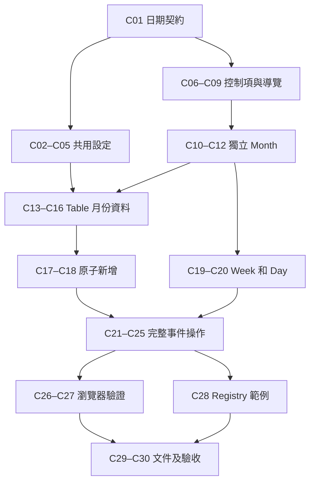

# Calendar view 實作計畫

日期：2026-09-16。狀態：已完成實作與驗證；證據見 [todo](todo.md)。

設計來源：[Calendar view 設計](../docs/superpowers/specs/2026-09-16-calendar-view-design.md)。執行狀態集中於 [todo](todo.md)，本文描述任務順序、涉及檔案與驗收方式，不另維護第二份勾選狀態。

## 實作時的測試分工

[測試設計](calendar-test-design.md) 在程式修改前完成。實作沿用既有 Timeline regressions，不為私有控制項的簡單轉送另開重複測試。日期純函式、UI 手勢、Table resource 和 browser geometry 各自負責不同的失敗模式。原子新增與操作串接抽到 `use-calendar-actions.ts`，讓 resource acceptance 與 UI layout 分離。Docs demo manifest 由 repository 現有 registry generator 產生。

## 交付邊界

規格、plan 與 todo 已先完成。使用者接著要求在 local branch 由 subagents 實作，並先設計測試；已依下列任務完成，實際完成狀態與驗證證據集中於 todo。

實作完成後，外部應用可使用 `@notion-kit/ui/calendar` 的 Month、Week、Day 與完整事件操作。Table Calendar 接上既有 rows、日期欄位與資料頁，和 Timeline 共用 `dateView` 設定及暫存瀏覽日期。

採用的邊界如下：

- Calendar 與 Timeline 各自負責排版和互動；range select、日期導覽和標題呈現的通用實作留在 UI 內部。
- `CalendarRangeSelect` 等 Calendar 專用元件依 Timeline 原則公開。既有 Timeline UI 匯出保留。
- Table 的 `timeline` 設定直接遷移為 `dateView`，不保留兩份持久化狀態。
- `anchorDate` 在 Table view 共用 context 保存，捲動不觸發持久化設定 callback。
- UI 事件結束邊界使用 exclusive end，Table adapter 處理全天日期的 inclusive end。
- 所有修改透過現有 resource contract；拖曳期間不寫入資料，新增 row 與初始日期一次提交。

## 實作前的 repository 規則

執行時重新確認 `git status`、AGENTS.md、`.agents/guidelines/coding.md` 及 package manager declarations。不要覆寫其他工作。

UI 元件實作使用 repository 的 using-primitives-for-components 技能。元件物件使用 component-page-object-models，MDX 文件使用 writing-component-docs。依實際工作套用 TDD 與 testing-strategy；為可觀察行為建立測試，不測內部實作細節。

沿用現有 dnd-kit、date-fns、時區工具、primitives 與 Icon。新增依賴只使用既有 workspace catalog；本計畫不更換 Node、pnpm 或 repository 工具鏈。

## 順序與 checkpoint

先驗證日期和資料契約，再以可操作的月份檢視接通 UI、Table 與 row creation。Week、Day 沿用這條資料路徑。完整拖曳與拉伸最後接到已驗證的資料更新 API。

| 階段 | 任務 | 可觀察結果 |
| --- | --- | --- |
| 日期契約 | C01 | 日期換算和時區邊界有測試 |
| 共用設定遷移 | C02～C05 | 現有 Timeline 正常使用 dateView |
| 共用 UI 和導覽 | C06～C09 | 控制項共用；Calendar 與 Timeline 可受控定位 |
| 獨立 Month | C10～C12 | 從公開入口使用月份日曆 |
| Table 月份資料 | C13～C16 | 切換保留日期，可讀取及開啟 rows |
| 原子新增 | C17～C18 | 從 Calendar 一次建立日期與 row |
| Week 和 Day | C19～C20 | 垂直時間格線、全天區與重疊事件 |
| 完整事件操作 | C21～C25 | 移動、雙端拉伸、跨區轉換、取消與鎖定 |
| 瀏覽器驗證 | C26～C27 | 真實幾何與 controlled resource 驗證 |
| 範例及交付 | C28～C30 | Registry、文件、Storybook 及最終驗收 |

C02～C05 是同一個 API 遷移批次。任務可分開編輯和檢查，但整批完成前不建立可交付的中間版本；否則 consumer 仍使用舊型別會造成暫時的編譯錯誤。其他任務每次都需保留已完成流程可用。

Checkpoint 設於 C01、C05、C08、C12、C16、C18、C20、C23、C25、C27 與 C30。Checkpoint 驗證失敗時先修正該階段，再開始依賴它的任務。已確認的範圍內可持續執行，不因例行 checkpoint 再要求使用者批准。

以下依賴圖只表達主要順序，各任務另列完整直接依賴：



## 任務規格

每項任務列出最多五個主要檔案。標為「新增」的是規劃中的檔案；其餘為已核對的既有檔案，或先前任務將建立的檔案。若實作發現影響面擴大，先在本文與 todo 補上小任務及依賴，不把跨套件變更隱藏在單一項目。

C01 的 lockfile 更新只由既有 pnpm 工具鏈產生。C30 原則上只更新驗收記錄；若驗收發現產品缺陷，回到對應任務處理。

### C01：建立 Calendar 日期與事件契約

**依賴**：無。**範圍**：M，5 個主要檔案。

定義 CalendarEventData、range、操作 callbacks 與日期換算。優先驗證 half-open 區間、當地日界線、空 end 和 DST；需要時沿用 workspace catalog 的 @date-fns/tz。

**涉及檔案：**

- `packages/ui/src/calendar/types.ts`（新增）
- `packages/ui/src/calendar/date-utils.ts`（新增）
- `packages/ui/src/calendar/__tests__/date-utils.test.ts`（新增）
- `packages/ui/package.json`
- `pnpm-lock.yaml`

**驗收條件：**

- 包含式全天日期能轉為 exclusive end，再無損轉回原日期。
- 跨午夜、DST、無效時間與空 end 的規則有行為測試。
- UI 型別不匯入 table-hook；事件資料由呼叫端持有。

**驗證**：V1：@notion-kit/ui，src/calendar/__tests__/date-utils.test.ts。

### C02：遷移 Table 共用日期設定

**依賴**：C01。**範圍**：M，5 個主要檔案。

以 dateView 取代 timeline 設定，新增共用 setter 和 action。layout 變更與必要的 range fallback 使用一次 resource 更新，initial/default/controlled 輸入使用相同 resolution 規則。

**涉及檔案：**

- `packages/table-hook/src/features/menu.ts`
- `packages/table-hook/src/table-contexts/use-table-view.tsx`
- `packages/table-hook/src/table-contexts/types.ts`
- `packages/table-hook/src/table-contexts/actions.ts`
- `packages/table-hook/src/__tests__/resource-api.test.tsx`

**驗收條件：**

- 兩種 view 共享 property 與 range，quarterly 或 weekly 不相容時改為 monthly。
- 受控 owner 拒絕變更時仍以外部 view 為準；resolution 不反覆觸發 callback。
- 只有一份日期設定，layout action 可以說明此次 fallback。

**驗證**：V1：@notion-kit/table-hook，src/__tests__/resource-api.test.tsx。與 C03～C05 同一遷移批次完成。

### C03：接回 Timeline 與 Layout menu

**依賴**：C02。**範圍**：M，5 個主要檔案。

把 Table view 的 Timeline 消費端接到 dateView，並更新受影響的設定測試。此步保留現有畫面和 Timeline 初始化行為。

**涉及檔案：**

- `packages/table-view/src/timeline-view/timeline-view-content.tsx`
- `packages/table-view/src/timeline-view/use-timeline-view-state.ts`
- `packages/table-view/src/menus/layout-menu.tsx`
- `packages/table-view/src/menus/layout-menu.test.tsx`
- `packages/table-view/src/common/bulk-edit/bulk-edit-bar.test.tsx`

**驗收條件：**

- Timeline 從共用設定取得 range 和 property，Layout menu 寫回共用 setter。
- 鎖定及隱藏、刪除 property 的處理不退化。
- 既有 bulk edit 與 layout fixtures 使用新 view shape。

**驗證**：V1：@notion-kit/table-view，src/menus/layout-menu.test.tsx、src/common/bulk-edit/bulk-edit-bar.test.tsx。

### C04：完成 Timeline 元件測試遷移

**依賴**：C03。**範圍**：M，3 個主要檔案。

更新舊設定、setter 與 action 斷言，保持原先的初始化、移動和拉伸行為驗證。

**涉及檔案：**

- `packages/table-view/src/timeline-view/timeline-view-content.test.tsx`
- `packages/table-view/src/timeline-view/timeline-dnd-interactions.test.tsx`
- `packages/table-view/src/timeline-view/use-timeline-view-state.test.tsx`

**驗收條件：**

- 既有無日期 property 初始化測試仍證明只建立一次並填入 metadata。
- 現有 Timeline 日期移動和 resize 的資料斷言仍成立。
- 測試使用既有 component objects，沒有新增只轉呼叫的 helper。

**驗證**：V1：@notion-kit/table-view，src/timeline-view。

### C05：遷移範例與瀏覽器測試的舊 API

**依賴**：C04。**範圍**：M，4 個主要檔案。

遷移 repo 內的公開範例與 E2E resource snapshot。以搜尋確認沒有殘留舊 Table timeline 設定或 action；保留獨立 UI 的 Timeline API。

**涉及檔案：**

- `apps/storybook/src/stories/collections/table-view/table-view.stories.tsx`
- `apps/docs/content/docs/blocks/table-view/index.mdx`
- `apps/e2e/tests/component-objects/table-view.ts`
- `apps/e2e/tests/timeline.spec.ts`

**驗收條件：**

- 範例使用 dateView；文件列出設定、setter 和 action 的改名。
- Timeline E2E 仍檢查真實初始化、移動、拉伸與 controlled resource。
- C02～C05 作為一個完整遷移 checkpoint 通過型別檢查。

**驗證**：V2：table-hook、table-view、storybook、e2e；V5：timeline.spec.ts。

### C06：抽出 UI 內部日期控制項

**依賴**：C01。**範圍**：M，4 個主要檔案。

建立不依賴 view context 的 range select、Previous/Today/Next 與標題呈現。使用既有 primitives、Icon 與主題 tokens。

**涉及檔案：**

- `packages/ui/src/date-view/range-select.tsx`（新增）
- `packages/ui/src/date-view/date-navigation.tsx`（新增）
- `packages/ui/src/date-view/date-title.tsx`（新增）
- `packages/ui/src/date-view/date-controls.test.tsx`（新增）

**驗收條件：**

- 選單接受各自的 range options，回報值且正確處理 disabled。
- 導航按鈕只呼叫對應 callback，不操作任何捲動容器。
- 沒有新增 public barrel 或 build entry。

**驗證**：V1：@notion-kit/ui，src/date-view/date-controls.test.tsx。

### C07：讓 Timeline 使用內部控制項

**依賴**：C06。**範圍**：M，5 個主要檔案。

用 Timeline 專用 wrapper 連接內部控制項，保留既有公開匯出、標題位置與水平導覽行為。

**涉及檔案：**

- `packages/ui/src/timeline/tools/timeline-range-select.tsx`
- `packages/ui/src/timeline/tools/timeline-jump-to.tsx`
- `packages/ui/src/timeline/timeline-range-header.tsx`
- `packages/ui/src/timeline/tools/timeline-range-select.test.tsx`
- `packages/ui/src/timeline/__tests__/timeline-components.test.tsx`

**驗收條件：**

- TimelineRangeSelect、TimelineJumpTo 等現有匯出仍可使用。
- Range 選項仍只有 daily、monthly、quarterly。
- 共用樣式不改變既有導覽結果。

**驗證**：V1：@notion-kit/ui，src/timeline/tools/timeline-range-select.test.tsx、src/timeline/__tests__/timeline-components.test.tsx。

### C08：建立 Calendar provider 與導覽工具列

**依賴**：C01、C06。**範圍**：M，5 個主要檔案。

提供受控與非受控 range、anchorDate，以及 Calendar 專用工具列匯出。Provider 保存導航與手勢狀態，事件真值仍由呼叫端持有。

**涉及檔案：**

- `packages/ui/src/calendar/calendar-provider.tsx`（新增）
- `packages/ui/src/calendar/calendar-context.ts`（新增）
- `packages/ui/src/calendar/calendar-toolbar.tsx`（新增）
- `packages/ui/src/calendar/__tests__/calendar-provider.test.tsx`（新增）
- `packages/ui/src/calendar/index.ts`（新增）

**驗收條件：**

- Previous、Today、Next 與 range 切換保留正確的瀏覽日期。
- Month、Week、Day 標題可處理跨月、跨年，時區和週起始日可指定。
- Callbacks 缺少、readOnly 或外部拒絕更新時，不自行改寫事件資料。

**驗證**：V1：@notion-kit/ui，src/calendar/__tests__/calendar-provider.test.tsx。

### C09：讓 Timeline 瀏覽日期可受控

**依賴**：C07。**範圍**：M，5 個主要檔案。

新增 anchorDate、defaultAnchorDate、onAnchorDateChange 與顯示時區支援。以扣除 sidebar 的可視區中央回報日期，保留 startDate/endDate 的既有用途。

**涉及檔案：**

- `packages/ui/src/timeline/timeline-provider.tsx`
- `packages/ui/src/timeline/types.ts`
- `packages/ui/src/timeline/utils.ts`
- `packages/ui/src/timeline/use-anchor-date.ts`（新增）
- `packages/ui/src/timeline/__tests__/timeline-provider.test.tsx`

**驗收條件：**

- 外部日期能定位 Timeline，使用者捲動也能更新外部日期。
- Sidebar 寬度、range 切換與節流尾端不造成回報漂移或 feedback loop。
- 超出時間軸範圍的定位可回報實際位置，未傳新 props 的用法維持原行為。

**驗證**：V1：@notion-kit/ui，src/timeline/__tests__/timeline-provider.test.tsx、src/timeline/__tests__/utils.test.ts。

### C10：計算 Month 與全天事件的分段

**依賴**：C01。**範圍**：S，2 個主要檔案。

以純函式產生月份日期、跨週分段與橫列分配。保留 event ID、來源偏移和真實起訖資訊，供之後的拖曳及 resize 使用。

**涉及檔案：**

- `packages/ui/src/calendar/month-layout.ts`（新增）
- `packages/ui/src/calendar/__tests__/month-layout.test.ts`（新增）

**驗收條件：**

- 月份包含完整的 4～6 週和補位日期。
- 多日事件跨週接續，同列相交事件不覆蓋，排列保持穩定。
- 每段保留是否為真正起點、終點及距原始開始日的偏移。

**驗證**：V1：@notion-kit/ui，src/calendar/__tests__/month-layout.test.ts。

### C11：呈現可開啟事件的 Month

**依賴**：C08、C10。**範圍**：M，5 個主要檔案。

完成月份格線、事件卡片和預設內容組合。提供 renderEvent 介面，呼叫端可組合事件元件而不計算座標。

**涉及檔案：**

- `packages/ui/src/calendar/calendar-month.tsx`（新增）
- `packages/ui/src/calendar/calendar-content.tsx`（新增）
- `packages/ui/src/calendar/calendar-range-header.tsx`（新增）
- `packages/ui/src/calendar/__tests__/calendar-components.test.tsx`（新增）
- `packages/ui/src/calendar/index.ts`

**驗收條件：**

- 事件卡片符合白底、細框、圓角、淡陰影，長標題不撐寬容器。
- 事件增加時整週高度同步增加，不裁切或產生水平捲動。
- 卡片與空白日期格可用鍵盤分別開啟事件或要求新增。

**驗證**：V1：@notion-kit/ui，src/calendar/__tests__/calendar-components.test.tsx；C12 進行瀏覽器檢查。

### C12：開放 Calendar 入口與獨立預覽

**依賴**：C09、C11。**範圍**：M，3 個主要檔案。

加入 calendar build entry 和可獨立操作的 Storybook 畫面。以一般應用匯入方式使用元件，驗證新入口與內部共用模組的界線。

**涉及檔案：**

- `packages/ui/tsdown.config.ts`
- `packages/ui/src/calendar/index.ts`
- `apps/storybook/src/stories/blocks/calendar-view.stories.tsx`（新增）

**驗收條件：**

- @notion-kit/ui/calendar 可匯入所有當階段完成的公開元件與型別。
- @notion-kit/ui/date-view 沒有可用的公開入口；現有日期 picker 不受影響。
- 月份跨週、多事件、窄容器和暗色模式可視檢查通過。

**驗證**：V2、V3：@notion-kit/ui；V6：獨立 Calendar 月份預覽。

### C13：在 Table 層保存瀏覽日期

**依賴**：C05、C09。**範圍**：M，4 個主要檔案。

在持續掛載的 Table wrapper 放置共用 anchorDate。Timeline 接入受控日期，Calendar 接入同一 context。

**涉及檔案：**

- `packages/table-view/src/date-view/date-view-navigation-provider.tsx`（新增）
- `packages/table-view/src/table-contexts/table-view-provider.tsx`
- `packages/table-view/src/timeline-view/timeline-view-content.tsx`
- `packages/table-view/src/date-view/date-view-navigation.test.tsx`（新增）

**驗收條件：**

- 瀏覽日期獨立於持久化 view resource，捲動不增加 onViewChange 次數。
- 日期 layout 卸載後，切到 Table 或 Board 再回來仍保留 anchorDate。
- 獨立的多個 Table instances 不共用彼此的瀏覽位置。

**驗證**：V1：@notion-kit/table-view，src/date-view/date-view-navigation.test.tsx；C16 補真實 Calendar 切換測試。

### C14：共用日期 property 解析與初始化

**依賴**：C03。**範圍**：M，5 個主要檔案。

抽出有效 property 判定和 fallback 流程。以呼叫端提供的初始化策略區分 Calendar 空日期與 Timeline metadata 初始化。

**涉及檔案：**

- `packages/table-view/src/date-view/date-property.ts`（新增）
- `packages/table-view/src/date-view/use-date-view-property.ts`（新增）
- `packages/table-view/src/date-view/use-date-view-property.test.tsx`（新增）
- `packages/table-view/src/timeline-view/timeline-adapter.ts`
- `packages/table-view/src/timeline-view/use-timeline-view-state.ts`

**驗收條件：**

- 已選 property 失效時依 column order 找到第一個可用 date property。
- Calendar 新建欄位不填入 row 日期，Timeline 原先初始化行為不變。
- 鎖定和 controlled owner 拒絕時，不持續建立或重送相同操作。

**驗證**：V1：@notion-kit/table-view，src/date-view/use-date-view-property.test.tsx、src/timeline-view/use-timeline-view-state.test.tsx。

### C15：把 Table rows 轉成 Calendar 事件

**依賴**：C01、C14。**範圍**：S，2 個主要檔案。

驗證日期值、轉換全天 end、挑選搜尋篩選後的實際 rows。Adapter 對無日期及無效資料回傳不顯示結果，不修改來源。

**涉及檔案：**

- `packages/table-view/src/calendar-view/calendar-adapter.ts`（新增）
- `packages/table-view/src/calendar-view/calendar-adapter.test.ts`（新增）

**驗收條件：**

- 全天 end 的包含語意、空 end、停用 end 及無效日期皆符合規格。
- Group headers 不變成事件，分組折疊不隱藏有效 leaf rows。
- 搜尋篩選有效，排序只影響相同時段的穩定來源順序。

**驗證**：V1：@notion-kit/table-view，src/calendar-view/calendar-adapter.test.ts。

### C16：啟用 Table Calendar 月份檢視

**依賴**：C12、C13、C15。**範圍**：M，5 個主要檔案。

接入 Calendar content、日期 property menu、共用 range 與 anchorDate。初步以 Month 證明完整的讀取、導航及開啟 row 流程。

**涉及檔案：**

- `packages/table-view/src/calendar-view/calendar-view-content.tsx`（新增）
- `packages/table-view/src/calendar-view/index.ts`（新增）
- `packages/table-view/src/calendar-view/calendar-view-content.test.tsx`（新增）
- `packages/table-view/src/table-contexts/table-view-provider.tsx`
- `packages/table-view/src/menus/layout-menu.tsx`

**驗收條件：**

- Layout menu 可選 Calendar，顯示資料並使用既有 rowView 開啟事件。
- Timeline monthly 瀏覽 12/16 後切換 Calendar 仍顯示 12 月；不支援 range 時 fallback 一次。
- Calendar 不使用 Table 的水平 ScrollableContent wrapper。

**驗證**：V1：@notion-kit/table-view，src/calendar-view/calendar-view-content.test.tsx、src/menus/layout-menu.test.tsx；V6：Table 月份流程。

### C17：支援一次建立 row 與初始日期

**依賴**：C02。**範圍**：M，3 個主要檔案。

讓 addRow 以向後相容的可選參數接收初始 cell 值，並提供新 row ID。建立資料使用一次 resource mutation，保留既有 default cells、位置與 action 語意。

**涉及檔案：**

- `packages/table-hook/src/features/row-actions.ts`
- `packages/table-hook/src/__tests__/row-actions.test.tsx`
- `packages/table-hook/src/__tests__/resource-api.test.tsx`

**驗收條件：**

- 新增時 authoritative proposal 已包含日期，只有一次 data.row.create。
- 既有 addRow 的位置參數與未指定初始值的行為維持原狀。
- Controlled owner 接受、拒絕及同一 render 的連續操作皆有測試。

**驗證**：V1：@notion-kit/table-hook，src/__tests__/row-actions.test.tsx、src/__tests__/resource-api.test.tsx。

### C18：從 Calendar 建立並開啟資料

**依賴**：C16、C17。**範圍**：M，3 個主要檔案。

將 onCreate 接到 row creation，等待新 ID 出現在 authoritative data 後才開啟。全天與指定時間使用相同建立流程。

**涉及檔案：**

- `packages/table-view/src/calendar-view/use-calendar-actions.ts`（新增）
- `packages/table-view/src/calendar-view/use-calendar-actions.test.tsx`（新增）
- `packages/table-view/src/calendar-view/calendar-view-content.tsx`

**驗收條件：**

- 日期格建立單日全天事件；時間落點建立一小時事件。
- 外部拒絕新增不會開啟不存在的 row，也不重複新增。
- 事件即使不符合目前 filter，也保留建立結果並從原始資料開啟。

**驗證**：V1：@notion-kit/table-view，src/calendar-view/use-calendar-actions.test.tsx。

### C19：計算時間格線分段與重疊

**依賴**：C01、C10。**範圍**：S，2 個主要檔案。

以純函式計算 timed events 的日期分段、時間座標及重疊欄位。處理最小視覺高度與 DST 重複時段的畫面避讓。

**涉及檔案：**

- `packages/ui/src/calendar/time-grid-layout.ts`（新增）
- `packages/ui/src/calendar/__tests__/time-grid-layout.test.ts`（新增）

**驗收條件：**

- 跨午夜分段仍保留同一事件 ID，午夜結束不占下一天。
- 相接事件不被當成時間重疊，真正重疊與視覺相交事件不互相遮蓋。
- 空 end 顯示一小時，短事件只增加視覺高度而不改寫時間。

**驗證**：V1：@notion-kit/ui，src/calendar/__tests__/time-grid-layout.test.ts。

### C20：呈現 Week 與 Day 時間格線

**依賴**：C11、C19。**範圍**：M，5 個主要檔案。

加入七欄和單欄共用版面、參考圖樣式的全天區、小時標籤和半小時隔線。使用同一個垂直內容捲動容器。

**涉及檔案：**

- `packages/ui/src/calendar/calendar-time-grid.tsx`（新增）
- `packages/ui/src/calendar/calendar-all-day.tsx`（新增）
- `packages/ui/src/calendar/calendar-content.tsx`
- `packages/ui/src/calendar/__tests__/calendar-components.test.tsx`
- `packages/ui/src/calendar/index.ts`

**驗收條件：**

- Week 有七欄，Day 有一欄，皆只有垂直捲動。
- 日期與工具列 sticky，全天區隨內容捲動。
- 初始 08:00 與 Today 時段定位、時間落點新增和事件開啟可使用。

**驗證**：V1：@notion-kit/ui，src/calendar/__tests__/calendar-components.test.tsx；V6：Week/Day 幾何與建立事件。

### C21：移動事件並保留來源偏移

**依賴**：C20。**範圍**：M，5 個主要檔案。

使用現有 dnd-kit 實作拖曳 preview 與 commit。跨週或跨日分段能移動原事件，抓取位置與開始日的偏移不丟失。

**涉及檔案：**

- `packages/ui/src/calendar/use-calendar-drag.ts`（新增）
- `packages/ui/src/calendar/calendar-event.tsx`（新增）
- `packages/ui/src/calendar/calendar-month.tsx`
- `packages/ui/src/calendar/calendar-time-grid.tsx`
- `packages/ui/src/calendar/__tests__/calendar-drag.test.tsx`（新增）

**驗收條件：**

- Month 保留當地開始時刻，時間格線對齊 15 分鐘，移動保留長度。
- 空 end 移動後保持 null，沒有把視覺長度寫回。
- 有效 drop 只發一次 callback，取消或 drop 外部沒有寫入。

**驗證**：V1：@notion-kit/ui，src/calendar/__tests__/calendar-drag.test.tsx；V6：跨週、跨日拖曳。

### C22：拉伸事件的真正起訖邊界

**依賴**：C21。**範圍**：M，5 個主要檔案。

加入雙端 resize handles、日與 15 分鐘精度，以及最短長度限制。分段的人工邊界不提供把手。完成 CalendarEvent.Root、Item、Resize 的公開匯出。

**涉及檔案：**

- `packages/ui/src/calendar/calendar-event.tsx`
- `packages/ui/src/calendar/use-calendar-drag.ts`
- `packages/ui/src/calendar/resize-utils.ts`（新增）
- `packages/ui/src/calendar/__tests__/calendar-resize.test.tsx`（新增）
- `packages/ui/src/calendar/index.ts`

**驗收條件：**

- 全天最短一天，指定時間最短 15 分鐘，不能翻轉起訖。
- 跨週或跨午夜時，只有真正起點和終點可拉伸。
- 空 end 在第一次拉伸後才建立真正結束值。

**驗證**：V1：@notion-kit/ui，src/calendar/__tests__/calendar-resize.test.tsx；V6：上下與左右邊界拉伸。

### C23：轉換全天與指定時間事件

**依賴**：C22。**範圍**：M，4 個主要檔案。

在跨區 drop 時產生一次 convert 操作，依已確認規則計算新起訖和 allDay。

**涉及檔案：**

- `packages/ui/src/calendar/conversion-utils.ts`（新增）
- `packages/ui/src/calendar/__tests__/conversion-utils.test.ts`（新增）
- `packages/ui/src/calendar/use-calendar-drag.ts`
- `packages/ui/src/calendar/__tests__/calendar-drag.test.tsx`

**驗收條件：**

- 單日全天變為一小時，多日全天保留日期跨度並於末日加一小時結束。
- 指定時間轉全天時保留涵蓋日期，午夜結束不多算一天。
- 轉換移除隱藏舊時間，取消則完整保留原值。

**驗證**：V1：@notion-kit/ui，src/calendar/__tests__/conversion-utils.test.ts、src/calendar/__tests__/calendar-drag.test.tsx。

### C24：把完整操作寫回 Table 日期

**依賴**：C18、C23。**範圍**：M，5 個主要檔案。

將 move、resize、convert 轉成一次 updateCell；事件卡片接上 title cell 呈現及 calendar surface。完整操作共用現有 resource 更新機制。

**涉及檔案：**

- `packages/table-view/src/calendar-view/use-calendar-actions.ts`
- `packages/table-view/src/calendar-view/calendar-adapter.ts`
- `packages/table-view/src/calendar-view/calendar-dnd-interactions.test.tsx`（新增）
- `packages/table-view/src/plugins/utils.tsx`
- `packages/table-view/src/calendar-view/calendar-view-content.tsx`

**驗收條件：**

- 所有操作正確轉回 DateData，保留 cell metadata、row ID 與沒有 end 的狀態。
- 不清除 sorting，不重新排列 rows；locked 時沒有資料更新。
- Controlled owner 拒絕時回到原資料，接受時只記錄一次對應 action。

**驗證**：V1：@notion-kit/table-view，src/calendar-view/calendar-dnd-interactions.test.tsx、src/calendar-view/calendar-adapter.test.ts。

### C25：完成手勢生命週期與鍵盤行為

**依賴**：C24。**範圍**：M，5 個主要檔案。

完成垂直 edge auto-scroll、Esc、click suppression 和手勢失效處理。整理焦點、accessible names 與 readonly 能力。

**涉及檔案：**

- `packages/ui/src/calendar/use-calendar-drag.ts`
- `packages/ui/src/calendar/calendar-event.tsx`
- `packages/ui/src/calendar/calendar-provider.tsx`
- `packages/ui/src/calendar/__tests__/calendar-drag.test.tsx`
- `packages/ui/src/calendar/__tests__/calendar-components.test.tsx`

**驗收條件：**

- 切換 range、日期、property 或外部事件值時，取消尚未提交的手勢。
- Auto-scroll 的位移計入落點，放開後只提交最終值，不誤開事件。
- 鍵盤可新增和開啟；readOnly 仍能導覽、瀏覽及開啟。

**驗證**：V1：@notion-kit/ui，src/calendar/__tests__/calendar-drag.test.tsx、src/calendar/__tests__/calendar-components.test.tsx；V6：自動捲動與鍵盤。

### C26：建立瀏覽器場景與 component objects

**依賴**：C25。**範圍**：M，5 個主要檔案。

提供固定日期的獨立 Calendar 與 Table controlled 場景，包含接受/拒絕 callbacks 的控制。操作以 event ID、日期和時段為語意介面。

**涉及檔案：**

- `apps/e2e/src/app/calendar/page.tsx`（新增）
- `apps/e2e/src/test-fixtures/calendar.ts`（新增）
- `apps/e2e/tests/component-objects/calendar.ts`（新增）
- `apps/e2e/tests/component-objects/table-view.ts`
- `apps/e2e/src/app/table-view/controlled/page.tsx`

**驗收條件：**

- 場景包含單日、跨週、跨午夜、重疊、空 end 與 DST 事件。
- Page objects 持有 selectors 與手勢，不在 specs 複製座標及選取細節。
- 受控拒絕場景可以直接觀察資料與 action 次數。

**驗證**：V2：@notion-kit/e2e；V6：人工操作 fixtures 並確認診斷資訊。

### C27：驗證真實瀏覽器中的完整流程

**依賴**：C26。**範圍**：M，3 個主要檔案。

透過 repository fixtures 驗證真實幾何與資料寫入。比較操作前後的 resources，並對代表畫面保留可供檢閱的截圖。

**涉及檔案：**

- `apps/e2e/tests/calendar.spec.ts`（新增）
- `apps/e2e/tests/calendar-table-view.spec.ts`（新增）
- `apps/e2e/tests/timeline.spec.ts`

**驗收條件：**

- 獨立元件與 Table 都通過三種 range、跨日分段、移動、拉伸與轉換。
- 驗證 sticky、event bounding boxes、scrollWidth 不超出 clientWidth，以及垂直 auto-scroll。
- 驗證共用 property/range/anchorDate、一次寫入與拒絕回復，Timeline 原有案例保持通過。

**驗證**：V5：calendar.spec.ts、calendar-table-view.spec.ts、timeline.spec.ts。

### C28：加入可安裝的 Calendar 範例

**依賴**：C25。**範圍**：M，5 個主要檔案。

增加獨立 Calendar 與 Table Calendar 範例。單一獨立 demo 可切換三種 range，包含跨日與重疊資料，不引入額外日曆套件。

**涉及檔案：**

- `packages/registry/src/calendar-demo/index.ts`（新增）
- `packages/registry/src/calendar-demo/calendar-demo.tsx`（新增）
- `packages/registry/src/table-view-calendar/index.ts`（新增）
- `packages/registry/src/table-view-calendar/table-view-calendar.tsx`（新增）
- `packages/registry/src/index.ts`

**驗收條件：**

- 獨立範例只使用公開 UI API，資料 callbacks 可實際操作。
- Table 範例示範共用設定與兩種日期 view 切換。
- Registry index 和生成流程能找到新範例。

**驗證**：V2、V3：@notion-kit/registry；V6：範例操作。

### C29：完成使用文件與 Storybook 範例

**依賴**：C27、C28。**範圍**：M，5 個主要檔案。

說明組合方式、控制權、日期邊界、操作 callbacks 與 Table API 遷移。Storybook 展示三種 range、完整互動與唯讀情境。

**涉及檔案：**

- `apps/docs/content/docs/blocks/calendar.mdx`（新增）
- `apps/docs/content/docs/blocks/table-view/index.mdx`
- `apps/docs/content/docs/blocks/timeline.mdx`
- `apps/storybook/src/stories/blocks/calendar-view.stories.tsx`
- `apps/storybook/src/stories/collections/table-view/table-view.stories.tsx`

**驗收條件：**

- 文件中的公開符號、props 和 import 都與實際實作一致。
- 說明 dateView 遷移及暫存 anchorDate，不把捲動描述為持久化設定。
- 預覽引用實際 registry entries，沒有與既有日期 picker 混淆。

**驗證**：V2：@notion-kit/docs、@notion-kit/storybook；V3：@notion-kit/docs；V6：文件預覽。

### C30：完成跨套件驗收與記錄

**依賴**：C29。**範圍**：S，1 個主要檔案。

執行適合本次變更的完整驗證，記錄實際結果和仍存在的限制。確認公開入口、Timeline 回歸與文件一起可用。

**涉及檔案：**

- `tasks/todo.md`

**驗收條件：**

- UI、table-hook、table-view 的 test/typecheck/lint/build 通過，修改的 registry/docs/storybook/e2e 完成適用檢查。
- 目標瀏覽器案例通過，三種版面的代表截圖經人工檢閱。
- Todo 的實作與驗證依證據勾選，未執行的項目保持未完成。

**驗證**：V1～V6 的最終適用檢查；git diff --check。

## 驗證命令與證據

以下命令用於實作與最終驗收，實際執行結果見 todo。所有 package-scoped pnpm 檢查在 sandbox 外執行。每次 pnpm 前都先成功執行 `nvm use 24.11.1 --silent`，使用指定的共用 store。

### V1：相關行為測試

每項任務已指定 package 與 test filter。將它們代入此命令；多個檔案可接在同一次 test 後：

```sh
nvm use 24.11.1 --silent && CI=true pnpm --config.store-dir=/Users/awen/Documents/Codex/.pnpm-store -F <package> test <test-file-or-directory>
```

例如 C01：

```sh
nvm use 24.11.1 --silent && CI=true pnpm --config.store-dir=/Users/awen/Documents/Codex/.pnpm-store -F @notion-kit/ui test src/calendar/__tests__/date-utils.test.ts
```

最終對 `@notion-kit/ui`、`@notion-kit/table-hook`、`@notion-kit/table-view` 分別移除 filter，跑完整 package tests。依賴的 package 使用 dist exports 時，先完成相應 V3 build。

### V2：型別與 lint

對任務列出的 package 分別執行，兩個命令各自初始化 Node：

```sh
nvm use 24.11.1 --silent && CI=true pnpm --config.store-dir=/Users/awen/Documents/Codex/.pnpm-store -F <package> typecheck
nvm use 24.11.1 --silent && CI=true pnpm --config.store-dir=/Users/awen/Documents/Codex/.pnpm-store -F <package> lint
```

縮寫 table-hook、table-view、registry、storybook、docs、e2e 均指相應的 `@notion-kit/<name>` package。

### V3：建置與套件入口

依賴順序為 UI → table-hook → table-view → registry → docs；storybook、e2e 在依賴套件完成後建置。

```sh
nvm use 24.11.1 --silent && CI=true pnpm --config.store-dir=/Users/awen/Documents/Codex/.pnpm-store -F <package> build
```

UI build 後檢查 `dist/calendar/index.mjs`、型別入口與公開 import。確認沒有可使用的 `@notion-kit/ui/date-view` 入口，並確認 `@notion-kit/ui/timeline` 與 `@notion-kit/ui/primitives` 的既有公開符號仍可匯入。

Docs 的現有 build 包含 registry 產生流程，會執行既有工具並更新生成物。依原流程執行，檢查生成 diff；不手寫生成 registry，也不以此次工作更換 registry 工具版本。

### V4：格式與差異檢查

使用 package-scoped format 的 write 模式或 repository format:fix，避免只有 check 的 `pnpm format`：

```sh
nvm use 24.11.1 --silent && CI=true pnpm --config.store-dir=/Users/awen/Documents/Codex/.pnpm-store -F <package> format --write
git diff --check
```

只保留本次需要的格式變更。Docs package 的既有格式指令排除 MD、MDX；這些文件另外做內容與格式檢查。

### V5：瀏覽器測試

```sh
nvm use 24.11.1 --silent && CI=true pnpm --config.store-dir=/Users/awen/Documents/Codex/.pnpm-store -F @notion-kit/e2e test:e2e tests/calendar.spec.ts tests/calendar-table-view.spec.ts tests/timeline.spec.ts --project=chromium
```

早期 checkpoint 尚未建立 Calendar specs 時，只指定當階段存在的 `tests/timeline.spec.ts`。沿用現有 pretest 建置和 Playwright webServer，不假設已有 dev server。Specs 從 `./fixtures` 匯入 `test` 與 `expect`。

### V6：視覺及操作檢查

在獨立 Calendar 與 Table Calendar 各檢查 Month、Week、Day。檢查寬、窄容器與深色模式，保留代表截圖及場景描述。寬度斷言針對 Calendar 容器，避免只確認外層頁面沒有水平捲軸。

操作至少包括跨週拖曳、跨午夜拉伸、重疊事件、全天互轉、上下邊緣 auto-scroll、鍵盤新增和開啟。紀錄所用時區、日期與資料場景，讓結果可以重現。

### 命令失敗的診斷

若 install、build 或 test 失敗，先報告 Node 與 pnpm 資訊，再分析錯誤。執行：

```sh
nvm use 24.11.1 --silent
node --version
"$NVM_BIN/pnpm" --version
"$NVM_BIN/pnpm" --config.store-dir=/Users/awen/Documents/Codex/.pnpm-store store path
```

另讀取當時的 `package.json`、`pnpm-workspace.yaml`、`pnpm-lock.yaml` 及 runtime/packageManager declarations。不得改用 Corepack、建立本地 store，或輸出 registry authentication tokens。

## 風險與處理

| 風險 | 影響 | 處理方式 |
| --- | --- | --- |
| Table 公開設定改名 | consumer 或保存的設定仍用 timeline | C02～C05 同批遷移，文件提供改名對照 |
| controlled owner 拒絕 | UI 假定寫入成功，打開不存在的 row | C17～C18 先驗證 authoritative 接受，C24 檢查回復 |
| 全天 end 換算 | 事件多一天或少一天 | C01、C15 明確分開 DateData 與 UI 區間 |
| DST 與午夜 | 日期錯位或事件相互覆蓋 | 最早的純函式測試及 C19 視覺重疊計算 |
| Timeline scroll feedback | 切換日期跳動或無限回報 | C09 區分使用者捲動和程式定位，C13 不寫 persisted view |
| 自動捲動中的拖曳 | pointer 和內容座標不一致 | C25 統一使用容器捲動後的座標，C27 用真實瀏覽器驗證 |
| UI 私有模組被意外公開 | 套件 API 增加不必要契約 | C12 檢查 build entries、barrels 與匯入結果 |

設計內的新增 API 名稱、初始時間格線定位 08:00、無效時區退回 UTC 與 DST 落點規則，是本份規格具體化的預設。它們已完整列入規格，供三份文件一起檢閱；沒有以模糊占位文字留待實作者猜測。

本計畫沒有需要另開探索專案的未決事項。文件仍待使用者檢閱；後續若改變已確認的產品行為，先同步更新規格和對應任務。
